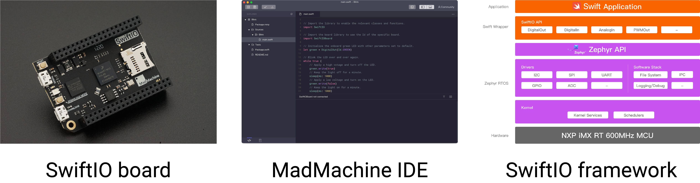

# Introduction

Welcome to the MadMachine 🎆 !

We are a team that focuses on the usage of the Swift language on microcontrollers. We have developed a whole environment, including **SwiftIO board**, **SwiftIO framework**, and **MadMachine IDE**.

The SwiftIO board is stable enough for most of your projects. We believe you will love it once you start. It is a special gift for makers, programming lovers, electronic hobbyists, or all those curious about new tech. This is super easy to learn. And as you go further, you will see the charm of the Swift language.

Some links are below for more info:

*  [Discord](https://discord.gg/zZ9bFHK) – come here and grow together
*  [Github page](https://github.com/madmachineio/Examples) – find SwiftIO source code
*  [Youtube channel](https://www.youtube.com/channel/UCFsoLnjIb0UXJYSz2X4nAVQ) – learn with us step-by-step
* [Twitter](https://twitter.com/madmachineio) – know who we are

This is a brand new platform and there is a lot to explore and create. Follow us step-by-step to begin your adventure. 

Hope all of you will enjoy it.

