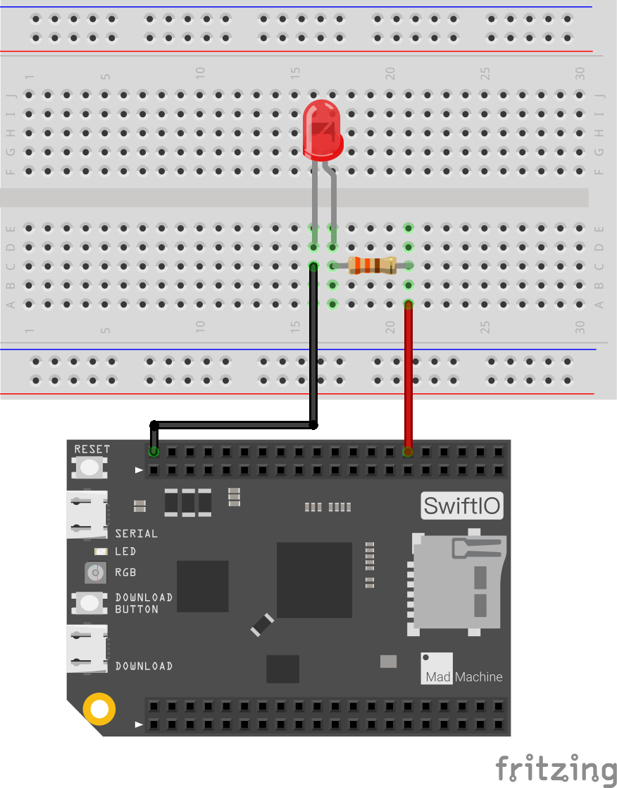

# PWMBrightnessControl

In this project, let's try to control the brightness of LED - light gradually on and off LED.

You will use PWM to set on-off ratio of output signal to get different voltage. The pins marked with “~“ can be used for this.

## What you need 

* SwiftIO board 
* LED 
* 330ohm resistor 
* breadboard 
* wires

## Circuit



Build the circuit as shown above.

* The anode \(positive leg\) of LED goes to PWM0A through resistor.
* The cathode \(negative leg\) of LED connects to ground.

## Code

```swift
// Brighten or dimming the LED by changing the duty cycle of PWM signal.

// Import the library to enable everything in it, like relevant classes and methods. 
// This is first step for your coding process.
import SwiftIO

// Initialize the pin PWM0A as output.
let led = PWMOut(Id.PWM0A)

// Initialize a variable to store the value of duty cycle. 
// It should be a float between 0.0 and 1.0.
var value: Float = 0.0

// In the loop, the code will run over and over again.
// Change the brightness from on to off and off to on all the time.
while true {
    // Brighten the LED in two seconds. 
    // Increase the duty cycle from 0.0 to 1.0.
    // The value should be changed little by little to ensure a smooth brightness change.
    while value <= 1.0 {
        led.setDutycycle(value)
        sleep(ms: 20)
        value += 0.01
    }
    // Keep the duty cycle between 0.0 and 1.0.
    value = 1.0

    // Decrease the value from 1.0 to 0.0 to dim the LED.
    while value >= 0 {
        led.setDutycycle(value)
        sleep(ms: 20)
        value -= 0.01
    }
    // Keep the duty cycle between 0.0 and 1.0.
    value = 0.0
}

```

You can find the example code at the bottom left corner of IDE:  &gt; GettingStarted &gt; PWMBrightnessControl.

