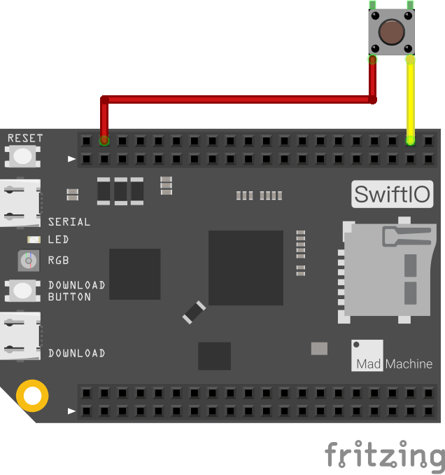

# ReadDigitalInput

In this example, let's try to read digital signal using a pushbutton. Here you will use serial monitor to show the input value.

## What you need

* SwiftIO board
* button
* wires

## Circuit



The button has four legs. The two legs on same side are interconnected. 

Connect one leg on the left side to 3.3 pin. And connect the leg on right side to digital pin D0.

In default mode, the digital pin reads `false`. When you press the button, the two points on the button will be connected. And the value of pin will be `true`.

So please be sure you connected the button in a right way. 

## Code

```swift
// Read the input voltage on a specified digital pin. 
// The value you get will be either true or false.

// Import the library to enable everything in it, like relevant classes and methods. 
// This is first step for your coding process.
import SwiftIO

// Initialize the pin D0 as a digital input pin.
let pin = DigitalIn(Id.D0)

// read the input every second.
while true {
    // Declare a constant to store the value you read from the digital pin.
    let value = pin.read()
    // Print the value and you can see it in the serial monitor.
    print(value)
    // Wait a second to slow the reading frequency.
    sleep(ms: 1000)
}
```

You can find the example code at the bottom left corner of IDE:  &gt; GettingStarted &gt; ReadDigitalInput.

