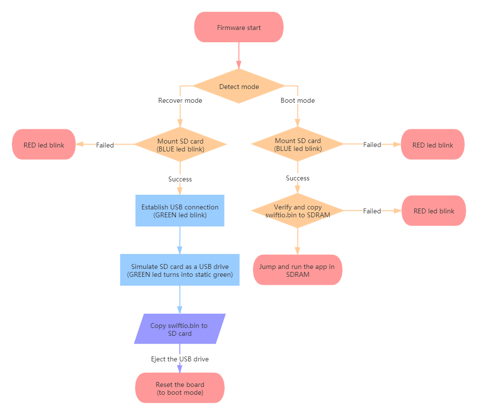
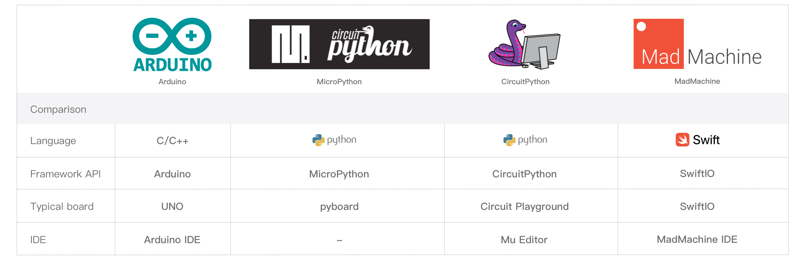

# About our project

## A big thank you!

Hi guys! It’s [Andy Liu](https://twitter.com/madmachineio). We started to sell the SwiftIO board in July. Till today \(8-Sep\), we have received nearly 100 orders from different countries. You guys are awesome! You are not only customers but angels for us. I want to express the depth of my gratitude to all of you!

Our original plan was to hold a Kickstarter campaign. So we could raise enough money in a very short time to support this project. Some of you might be familiar with this crowdfunding platform, me too. Actually I had a project named [EVB ](https://www.kickstarter.com/projects/fatcatlab/evb-replace-the-brain-of-your-lego-ev3-with-beagle?ref=discovery&term=evb)on Kickstarter a few years ago. In my experience, these kinds of hardware projects usually encounter problems even if they raise a lot of money. Because there’s such a huge gap between a prototype and a mature product. It’s so hard for a small team to face so many problems at the very beginning, those problems might kill the founding team. Sadly, I’ve seen a lot of cases already 😱 

Since our project may take years to be perfect, I decided to run our project in a more steady way so we have more chances to incorporate your feedback and improve continuously. It might evolve slower, but nothing could kill us.

At present, the SwiftIO board hardware is stable. But the software still needs improvement. We have already received some issues about the software:

* The IDE has problems in different OS environments
* The USB drive may not appear after pressing DOWNLOAD button

Here, I’ll give a brief explanation about the techniques we use in our project. After reading this article, you would know the principle of our project and what to do if you encounter some issues before we solve them.

**Again, thanks very much for your support in such an early stage! Hope we could grow together in the long term** 😘 

## Background

As you know, for those people who aren’t familiar with Swift, they regard it as an Apple exclusive-use programming language. But we know that’s wrong. Swift is modern, safe, efficient and especially, cross-platform. That’s why I have confidence to make this language work in the microcontroller world. \(Some of you might mention Rust, but I have to admit that Rust is too hard for me to get started😭\)

Before we start, you could have a look at the definition of Clang [here](https://clang.llvm.org), it is described as **a C language family frontend for LLVM**.

Similarly, Swift is **a Swift language frontend for LLVM,** sounds weird? A little.

Swift leverages all the infrastructures of LLVM, so it doesn't need to implement various architecture backends. But still a lot of work needs to be done. The official Swift team focuses mainly on x86-64 and ARM Cortex-A architectures. Thanks to the good infrastructure of LLVM, what I did is just combine existing ARM Cortex-M backend with the Swift compiler source code. It’s so natural that not only I thought of this way. During my exploration, I referred to those resources:

* [swift-project1](https://github.com/spevans/swift-project1) by [Simon Evans](https://twitter.com/sp_evans), it gave me the initial confidence to start this project from the beginning.
* [modocache.io](https://modocache.io/) by [Brian Gesiak](https://twitter.com/modocache), it gave me a brief knowledge about how Swift compiler works.
* [swift-embedded](https://github.com/swift-embedded/swift-embedded) by [Alan Dragomirecký](https://twitter.com/aldrago), his work is so professional and profound that inspired me a lot.
* [swift for arduino](https://www.swiftforarduino.com/) by [Carl Peto](https://twitter.com/carl_the_dev), his attempt of running Swift on AVR backend is really unique.

Enthusiasts around the world are trying different ways to explore new possibilities in this brand new field. We share the same curiosity and passion. We believe that Swift would do something magic in the embedded world in the future!

Unlike the **swift-project1** and **swift-embedded** which run completely on bare-metal, we chose [Zephyr RTOS](https://docs.zephyrproject.org/latest/boards/arm/mm_swiftio/doc/index.html) to abstract the low-level hardware. In this way, we don’t need to write those on-chip devices’ drivers, like I2C, UART, SPI etc... And it would be very convenient to port our framework to other microcontrollers. This definitely simplifies our works in the future. The structure of our framework is just as follows:

## How does the building procedure work?

If your project is built successfully, you would notice there will be a file called `swiftio.bin` generated in the `.build` directory. You just need to copy it to the root directory of the SD card, eject it, then SwiftIO board will reset and run your code.

When you click the build button or download button, the IDE will use related tools and libraries in [mm-sdk](https://github.com/madmachineio/mm-sdk/releases) to build the whole project. At present, the build script is written in Python. Later, when Swift package manager could run well in Windows, we are going to rewrite it using Swift. So we can take full advantage of the package management feature of SPM. Now, let me explain in detail the whole process of building. Suppose you create a project named **Blink**:

When you click the **build** or **download button** in the IDE, here are what the IDE will do:

* Open a terminal and change directory to the Blink project
* Execute `path_to/mm-sdk/tools_mac/scripts/dist/mm/mm build --sdk path_to/mm-sdk --module ~/Document/MadMachine/Library`

If you were clicking the **download button**, there will be two extra steps:

* Copy `Blink/.build/swiftio.bin` to the USB drive
* Eject the USB drive

The command in the second step is responsible for the whole building process. Two arguments in the command means:

* `--sdk` The path to mm-sdk
* `--module` The path to the Library. Since currently there is no available package management feature, we have to put all the dependent libraries into the same folder, and then assign it when invoking this building command.

Let’s talk about how the command works in detail:

1. The Python script will find and build all the dependencies in the specified library folder. Then the static libraries will be generated according to the dependencies defined in the `Blink.mmp` \(Actually it’s a TOML file\)
2. Build your own project to generate a static library `libBlink.a`
3. Link all the related static libraries together to generate `Blink.elf`
4. Invoke objcopy to convert Blink.elf to `Blink.bin`
5. Append 4 bytes CRC information to `Blink.bin`, then we get `swiftio.bin`

## What happens after power up or reset?

You might be wondering how the `swiftio.bin` is loaded and executed on the board. In fact, a pre-installed bootloader \(or called firmware\) has been written into the on-board Flash. This flow chart would reveal the key information about how it works:

Also, I would like to say, we now use **copy and run mode**, your application would be copied from the SD card and run in the SDRAM. In fact, your project could be built in **XIP mode**. In this mode, your project is the firmware itself. But you need to write the `.bin` file to the on-board Flash. In this condition, you don’t need a SD card at all.

## What’s the difference between SwiftIO and the similar boards in the market?

### Arduino:

Arduino gave birth to the trend of electronic makers and it gained great success. What’s more, many open source projects based on Arduino were successful as well.

In my opinion, Arduino is the most successful attempt to simplify the API of hardware. It still uses C/C++, however, it abstracts all the on-chip devices and offers easy-to-use API to developers. Through long time evolution and accumulation, you can now easily find plenty of Arduino drivers of hardware modules. It makes hardware development as simple and fun as playing with LEGO.

### MicroPython:

As we can see, Python has become so popular in recent years. Compared to C/C++, it is very easy-to-learn. As an interpreted language, users could see the results immediately without finishing all the code and compiling it. To realize MicroPython, [Damien George](https://micropython.org/) created an efficient interpreter using C. This could run in the extremely limited microcontroller environment. In this way, developers are able to use Python in the embedded world.

However, Python needs to be interpreted. This leads to low efficiency when running it. So most complicated projects based on MicroPython implement their core algorithm in C, just provide some simple Python API to the users, such as [OpenMV](https://openmv.io/) and [CircuitPython](https://circuitpython.org/).

### Raspberry Pi

[Raspberry Pi](https://www.raspberrypi.org/), in fact, is totally different from what we talk about here. However, many guys couldn't tell it from microcontrollers. So I would like to explain a little.

Raspberry Pi is actually a well-equipped computer, but small in size. It runs a full Linux operating system, you can connect keyboard, mouse, hard disk and display to it. The only similarity with microcontrollers may be some commonly used on-chip devices, like GPIO, I2C, SPI, which can be controlled by [Swift ](https://github.com/uraimo/SwiftyGPIO)\(Linux version\) as well.

It is built on complicated hardware and software. Designing a board that can run Linux is much more difficult than a microcontroller board, moreover, the board needs to be adapted to the Linux system which is more complicated.

On the contrary, when our project comes to a stable state, we will provide an easy way to port different boards so that all kinds of boards could join in this ecosystem. I wish more and more hardware boards could use Swift.

### Back to our project

For my part, our project is more like a combination of **Arduino** and **MicroPython**. Swift is not only modern and easy-to-learn like Python, but also efficient like C/C++. The only weakness now is that the generated bin file has a large size, thus it’s hard to be put into Flash of low-end microcontrollers. But we will continue to explore new ways to reduce its size.

In addition, We would gradually provide more and more Swift libraries and try our best to take full advantage of Swift language. Imagine that one day, you could program different screens in SwiftUI style. How cool that would be : \)

## Some issues from your feedback

### IDE related

The IDE is based on Electron framework, you could regard it as a graphical interface of mm-sdk. The design principle is to give beginners an easy-to-start environment to edit and build their own project. The main purpose of the IDE is to help users to invoke the build script, copy `swiftio.bin` to the USB drive and eject the USB drive in the background.

#### Can’t find the SwiftIO library when building

The IDE would copy built-in Examples and Library to the user's `Documents/MadMachine` folder when you first run it. But it may encounter permission problems. If it failed to copy those files, you would meet errors when building your project. Check out if there are those two directories in your `Documents/MadMachine` first.

#### Get messy code when building a project under Windows

This is a known issue in Swift compiler. Swift does not officially support Windows yet. Since Swift 5.3 would officially support Windows in a very short time, we’ll check this out then.

### USB drive related

#### Can not mount the SD card as a USB drive or the connection is not stable

This problem may be caused by these reasons

1. Bad quality USB cable, there are so many bad quality USB cables in the market. Some of them can only charge your device without communication feature : \(
2. Incompatible microSD card
3. Incompatible USB hub or incompatible USB-C to USB-A adapter
4. There is a known issue about USB compatibility on Mac. There are already a lot of discussion about it on [reddit](https://www.reddit.com/r/mac/comments/gp5b1z/usb_20_issues_on_new_macbook_pro_13_2020/), [apple](https://discussions.apple.com/thread/251356598).

To solve problem 1 and 2, we offer a high quality USB cable and a Kingston microSD card along with our board. But we still got feedback that the USB drive did not appear. In this situation, there is a temporary solution: use a microUSB card reader to copy the `swiftio.bin`. At the same time, we’ll continue to improve the compatibility of the firmware.

