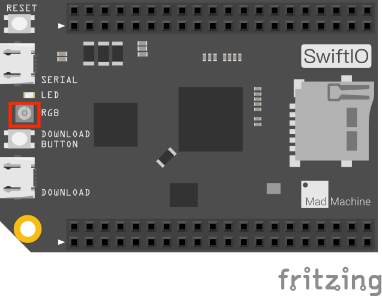
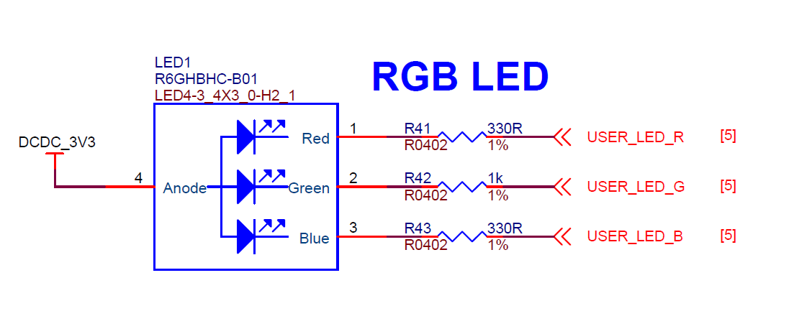

# <span style="color:#EA5823;font-weight:800">Blink</span>


Let's first come to an easy beginner project - blink the onboard LED. This example shows the simplest thing you can do with just a SwiftIO board to see physical output: it blinks the on-board REG LED.

## <span style="color:#EA5823;font-weight:700">What you need</span>

- SwiftIO board

## <span style="color:#EA5823;font-weight:700">Circuit</span>



<em>image developed using Fritzing. For more circuit examples, see the Fritzing project page</em>

For this project, we only need the SwiftIO board.

There is a built-in RGB LED on the board. You can control it using the methods in `DigitalOut` class.

_**Note**: the onboard LED will be turned on when you apply a **low** voltage._

Just plug the board to your computer through a USB cable after you finished code.

## <span style="color:#EA5823;font-weight:700">Schematic</span>



## <span style="color:#EA5823;font-weight:700">Code</span>

It's time for the code. Let's see how it works.You can find the example code at the bottom left corner of IDE:  &gt; GettingStarted &gt; Blink.


```swift
// Import the library to enable everything in it, like relevant classes and methods. 
// This is first step for your coding process.
import SwiftIO

// Declare a constant. You may choose any descriptive name you like. 
// Initialize the onboard green LED. 
// The Id of onboard LED should be capitalized.
let green = DigitalOut(Id.GREEN) 

// In the dead loop, the code will run over and over again.
while true {
    // Output 3.3V to turn off the green LED.
    green.write(true)
    // Pause for a second. Or, you won't notice LED state change. 
    // During this period, the board will do nothing but just wait.
    sleep(ms: 1000)
    
    // Output 0V to turn on the green LED.
    green.write(false)
    sleep(ms: 1000)
}
```

## <span style="color:#EA5823;font-weight:700">Instruction</span>
`import SwiftIO`是引用此名称库，在本教程中，所有案例程序须先引用此库
let是Swift语言声明常量的关键字，我们以后将会经常使用它来给每个端口指定名称，便于引用。`Id`是一个枚举，枚举Id的所有类型可以在See Also查看，其成员包含了所有的的IO端口。由于pinMap上并没有标识RED, GREEN, BLUE你可能会感到困惑。因为在SwiftIO板上已经默认搭载了RGB三色LED并且串联了电阻，这三个端口内部连接LED相应引脚如电路图所示。
`while`循环设置为`true`表示此循环检验永远为真，除非硬件掉电或者重启，此循环进入后往复不尽。循环体是循环代码的部分，由大括号对`{}`括起并且需要缩印以便阅读。
`.write()`方法属于`DigitalOut`对象其传入的值有`true`和`false`,分别代表输出高电平(3.3V)和低电平（0V or GND)。
`sleep(ms:)`函数属于内置函数，表示延迟时间，以毫秒为单位计算，必须加上参数外部名`ms`才能传入参数。


## <span style="color:#EA5823;font-weight:700">See Also</span>

- Id - Enumerations, public enum Id : UInt32
- sleep(ms:) - function suspend the processor’s work in a given time period (in millisecond).
- DigitalOut() - DigitalOut class is used to set a High or Low voltage output to a digital output pin

## <span style="color:#EA5823;font-weight:700">References</span>

---
Last revision 2020/09/04 by Johnson