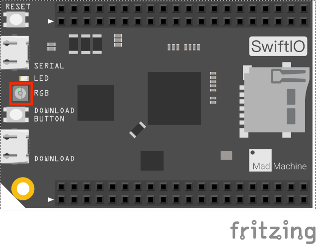

# Blink

Let's first come to an easy beginner project - blink the onboard LED.

## What you need

• SwiftIO board 

## Circuit



For this project, we only need the SwiftIO board.

There is a built-in RGB LED on the board. You can control it using the methods in `DigitalOut` class.

_**Note**: the onboard LED will be turned on when you apply a **low** voltage._

Just plug the board to your computer through a USB cable after you finished code.

## Code

It's time for the code. Let's see how it works.

Import the library to enable everything in it, like relevant classes and methods. This is first step for your coding process.

`import SwiftIO`

Declare a constant. You may choose any descriptive name you like. Initialize the onboard green LED. The Id of onboard LED should be capitalized. [Here](https://swiftioapi.madmachine.io/Enums/Id.html) is the Id enumeration.

`let green = DigitalOut(Id.GREEN)`

In the dead loop, the code will run over and over again.

`while true`

Output 0V or 3.3V to control the green LED.

`green.write(true)`

`green.write(false)`

Pause for a second. Or, you won't notice LED state change. During this period, the board will do nothing but just wait. 

`sleep(ms: 1000)`

```swift
// Import the library to enable everything in it, like relevant classes and methods. This is first step for your coding process.
import SwiftIO

// Declare a constant. You may choose any descriptive name you like. Initialize the onboard green LED. The Id of onboard LED should be capitalized. Here is the Id enumeration.
let green = DigitalOut(Id.GREEN)

// In the dead loop, the code will run over and over again.
while true {
    // Output 0V or 3.3V to control the green LED.
    green.write(true)
    sleep(ms: 1000)
    
    green.write(false)
    //Pause for a second. Or, you won't notice LED state change. During this period, the board will do nothing but just wait. 
    sleep(ms: 1000)
}
```

You can find the example code at the bottom left corner of IDE:  &gt; GetStarted &gt; Blink.

