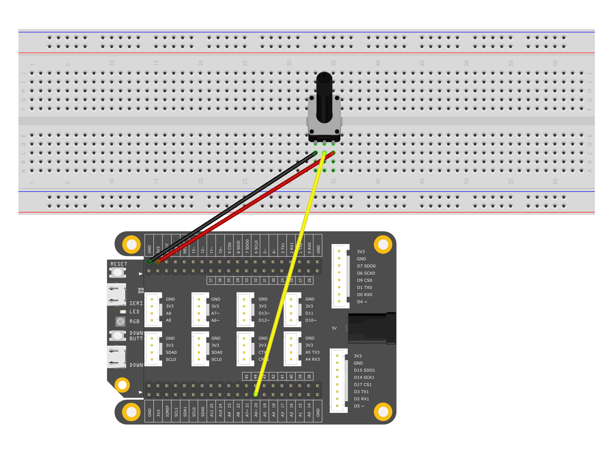

# ReadAnalogInput


In this new example, you are going to read analog input. You'll use a potentiometer.

The potentiometer can provide a certain range of resistance. When you twist the knob, the resistance will change, thus the input voltage will change with it.

When SwiftIO board reads from the pin, it will get a number between 0 and 4095. And then change it into a digital number between 0 and 3.3V.

## What you need

* SwiftIO board
* Potentiometer
* Jumper wires

## Circuit



Let's build the circuit now.

The potentiometer has three legs:

* the first leg on the left goes to ground
* the second leg goes to power
* the third leg goes to goes to analog pin A6

Different potentiometer may vary, so please refer to its manual before building the circuit.

## Code

You can find the example code at the bottom left corner of IDE:  &gt; GettingStarted &gt; ReadAnalogInput. Well, you may try to read from to other modules, like sensors. It's quite interesting.

For the code, you will use the `AnalogIn` class.

```swift
// Read the input voltage on a specified analog pin. 
// The value you get will be a float number between 0.0 and 3.3.

// Import the library to enable everything in it, like relevant classes and methods. 
// This is first step for your coding process.
import SwiftIO

// Initialize the pin A6 as a analog input.
let pin = AnalogIn(Id.A6)

// Read the input voltage every second.
while true {
    // Declare a constant to store the value.
    // Read the voltage value from the analog pin.
    let value = pin.readVoltage()
    // Print the value and you can see it in the serial monitor.
    print(value)
    // Wait a second to slow the reading frequency.
    sleep(ms: 1000)
}
```

## Instruction

The parameter passed by the object `AnalogIn` must be the port \(A0-A11\) that can be used for analog input in the enumeration `Id`.

There are three methods for returning the analog value in this object. `.readVoltage()` returns the voltage value . The return value is a floating point number between 0V-3.3V.

`print()` function is to print the result directly to the serial port. You can conveniently use a computer to connect to the serial port of the SwiftIO Board to view the results and debug.

Please note that the SwiftIO Board has two USB ports. The port used to load programs cannot be used as a monitor serial port, so you need to change the line. For details, please see the [Tips](readanaloginput.md#tips) operations below. Both USB ports can be used as power supply ports for SwiftIO Board.

## See Also

* [Id](https://swiftioapi.madmachine.io/Enums/Id.html) - Enumerations of all pins on the board
* [AnalogIn.readRawValue\(\)](https://swiftioapi.madmachine.io/Classes/AnalogIn.html#/s:7SwiftIO8AnalogInC12readRawValueSiyF) - Read the current raw value from the specified analog pin.

## References

* [wiki: Potentiometer](https://en.wikipedia.org/wiki/Potentiometer)
* [wiki: Voltage divider](https://en.wikipedia.org/wiki/Voltage_divider)

## Tips


