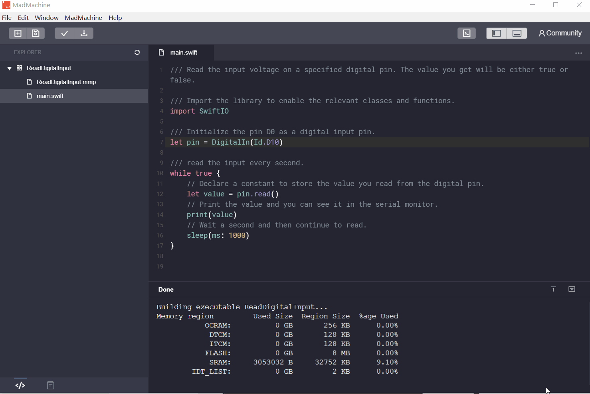
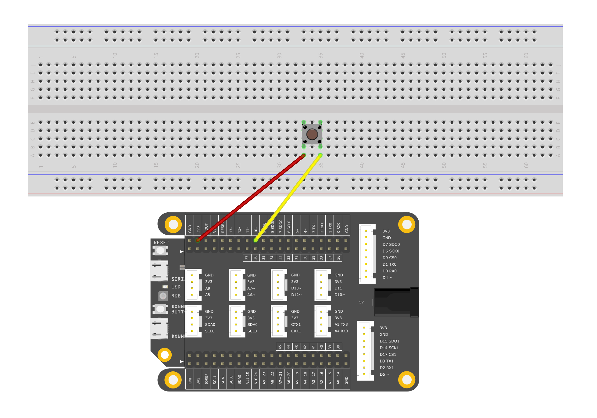

# <span style="color:#EA5823;font-weight:800">ReadDigitalInput</span>


---



In this example, let's try to read digital signal using a pushbutton. Here you will use serial monitor to show the input value.

## <span style="color:#EA5823;font-weight:700">What you need</span>

* SwiftIO board
* button
* wires

## <span style="color:#EA5823;font-weight:700">Circuit</span>



The button has four legs. The two legs on same side are interconnected. 

Connect one leg on the left side to 3.3 pin. And connect the leg on right side to digital pin D0.

In default mode, the digital pin reads `false`. When you press the button, the two points on the button will be connected. And the value of pin will be `true`.

So please be sure you connected the button in a right way. 

## <span style="color:#EA5823;font-weight:700">Code</span>

You can find the example code at the bottom left corner of IDE:  &gt; GettingStarted &gt; ReadDigitalInput.

```swift
// Read the input voltage on a specified digital pin. 
// The value you get will be either true or false.

// Import the library to enable everything in it, like relevant classes and methods. 
// This is first step for your coding process.
import SwiftIO

// Initialize the pin D0 as a digital input pin.
let pin = DigitalIn(Id.D10)

// read the input every second.
while true {
    // Declare a constant to store the value you read from the digital pin.
    let value = pin.read()
    // Print the value and you can see it in the serial monitor.
    print(value)
    // Wait a second to slow the reading frequency.
    sleep(ms: 1000)
}
```

## <span style="color:#EA5823;font-weight:700">Instruction</span>

The parameter passed by the object `DigitalIn` must be the ports (D0-D45) that can be used for digital input in the enumeration `Id`, and the return value is `true` or `false`, representing high level and low level respectively. The `print()` function is a parameter to print the result directly to the serial port. You can conveniently use a computer to connect to the serial port of the SwiftIO Board to view the results and debug. Please note that the SwiftIO Board has two USB ports. The port used to load programs cannot be used as a monitor serial port, so you need to change the line. For details, please see the Tips operations below. Both USB ports can be used as power supply ports for SwiftIO Board.

<!--
对象`DigitalIn`传入的参数必须是枚举`Id`中可用于数字输入的端口(D0-D45)，其返回值是`true`或`false`，分别代表高电平和低电平。`print()`函数是直接向串口打印结果的参数，可以方便的使用计算机连接SwiftIO Board的串口后查看结果，并调试。请注意，SwiftIO Board有两个USB连接口，其中用于载入程序的接口并不能作为监听串口使用，所以需要进行换线操作，具体请查看下面Tips种的操作。这两个USB接口均可作为SwiftIO Board的供电接口。
-->


## <span style="color:#EA5823;font-weight:700">See Also</span>

- [Id](https://swiftioapi.madmachine.io/Enums/Id.html) - Enumerations, public enum Id : UInt32
- [AnalogIn.readRawValue()](https://swiftioapi.madmachine.io/Classes/AnalogIn.html#/s:7SwiftIO8AnalogInC12readRawValueSiyF) - Read the current raw value from the specified analog pin.

## <span style="color:#EA5823;font-weight:700">References</span>

- [Potentiometer](https://en.wikipedia.org/wiki/Potentiometer)
- [Voltage divider](https://en.wikipedia.org/wiki/Voltage_divider)

## <span style="color:#EA5823;font-weight:700"> Tips</span>


---
Last revision 2020/09/04 by Johnson


