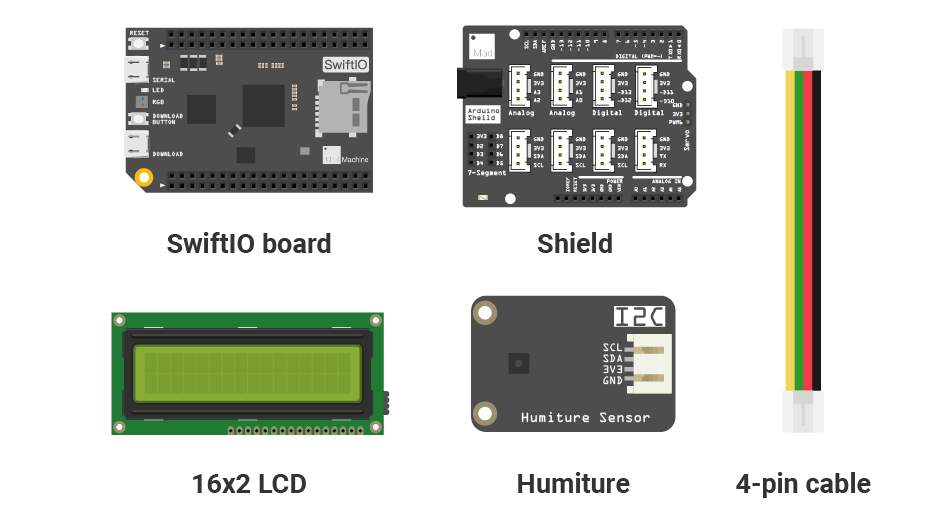
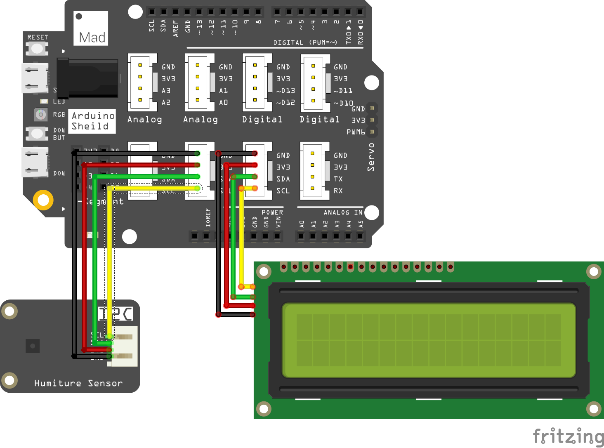
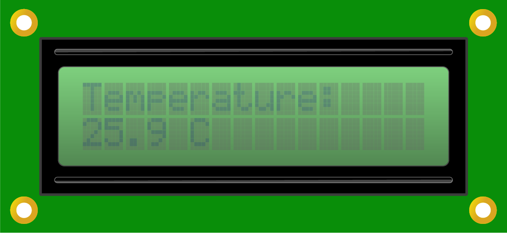

# Mission10\_Humiture\_Sensor

In the previous mission, you learn about the LCD. Now you're going to know more about it, the LCD will be used to show the temperature in your room.

## What you need



## Circuit

### Circuit diagram



### Build your circuit

Place the shield on top of the SwiftIO board. 

Connect the humiture sensor and the LCD to the **I2C0**. There are three available pins, you could choose any two.

## Example code

You could open the code in the  &gt; MakerKit &gt; Mission10\_Humiture\_Sensor.

```swift
// Import the SwiftIO library to use everything in it.
import SwiftIO

// Import the board library to use the Id of the specific board.
import SwiftIOBoard


// Initialize the LCD and sensor to use the I2C communication.
let i2c = I2C(Id.I2C0)
let lcd = LCD1602(i2c)
let sht = SHT3x(i2c)

while true{
    // Read and display the temperature on the LCD and update the value every 1s.
    let temp = sht.readCelsius()

    lcd.write(x:0, y:0, "Temperature:")
    lcd.write(x: 0, y: 1, temp)
    lcd.write(x:4, y:1, " ")
    lcd.write(x:5, y:1, "C")

    sleep(ms: 1000)
}
```

## What you'll see

After you download the code, the LCD starts to display the temperature. The value will slightly change.



## Humiture sensor

The humiture sensor could sense the temperature and humidity at the same time. 

It uses the I2C protocol to communicate with the SwiftIO board. You could find a file `SHT3x.swift` in this mission that you could use to read the values. 

## Code Analysis

In this project, you could find the file [`LCD1602.swift`](https://github.com/madmachineio/MadExamples/blob/main/MakerKit/Mission10_Humiture_Sensor/Sources/Mission10_Humiture_Sensor/LCD1602.swift) for the LCD and the file [`SHT3x.swift`](https://github.com/madmachineio/MadExamples/blob/main/MakerKit/Mission10_Humiture_Sensor/Sources/Mission10_Humiture_Sensor/SHT3x.swift) for the sensor. You could directly use them to simplify your code and don't need to configure them according to their data sheet.

So let's come to the file `main.swift`. 

Import the necessary libraries. Initialize the I2C interface I2C0. Then initialize the LCD and the sensor. Both of them need the I2C interface as their parameter. 

```swift
let temp = sht.readCelsius()
```

To get the temperature, you need the method `readCelsius()` in the file `SHT3x.swift`. It will calculate the temperature into Celsius. 

```swift
lcd.write(x:0, y:0, "Temperature:")
lcd.write(x: 0, y: 1, temp)
lcd.write(x:4, y:1, " ")
lcd.write(x:5, y:1, "C")
```

As you get the value, you could display it on the LCD. The four statements are all about the content to be displayed:

* The first row of the LCD will display the text "Temperature:". It starts from the origin.
* The temperature will be displayed on the second row from the first column. They will take up four characters.
* The fifth is blank to separate the value from the unit.
* The sixth is the unit.

```swift
sleep(ms: 1000)
```

This means the sensor will read value every 1s, so the value on the LCD will be refreshed per second.

