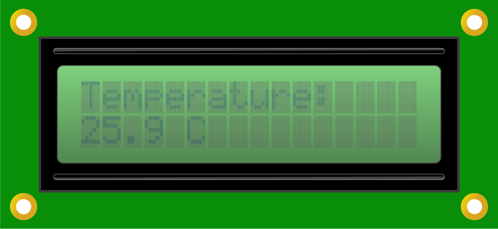

# Mission11\_Reproduce\_Mission10

This mission is similar to Mission10. You will display the temperature on the LCD. But you will use an external library to realize it.

## What you need


## Circuit

### Circuit diagram


### Build your circuit

Place the shield on top of the SwiftIO board. 

Connect the humiture sensor and the LCD to the **I2C0**. There are three available pins, you could choose any two.

## Example code

You could open the code in the  &gt; MakerKit &gt; Mission10\_Humiture\_Sensor.

```swift
// Import the SwiftIO library to use everything in it.
import SwiftIO

// Import the board library to use the Id of the specific board.
import SwiftIOBoard

// Import LCD1602 and SHT3x driver from MadDrivers which is an online git repo
import LCD1602
import SHT3x

// Initialize the LCD and sensor to use the I2C communication.
let i2c = I2C(Id.I2C0)
let lcd = LCD1602(i2c)
let sht = SHT3x(i2c)

while true{
    // Read and display the temperature on the LCD and update the value every 1s.
    let temp = sht.readCelsius()

    lcd.write(x:0, y:0, "Temperature:")
    lcd.write(x: 0, y: 1, temp)
    lcd.write(x:4, y:1, " ")
    lcd.write(x:5, y:1, "C")

    sleep(ms: 1000)
}
```

## What you'll see

After you download the code, the LCD starts to display the temperature. The value will slightly change.



## Code Analysis

You will use the library LCD1602 and SHT3x in your code. 

In the previous mission, the two files are included, so you could directly use them. Now, they are in the library `MadDriver`, you just import them into your code. Then the rest of the code is the same.

