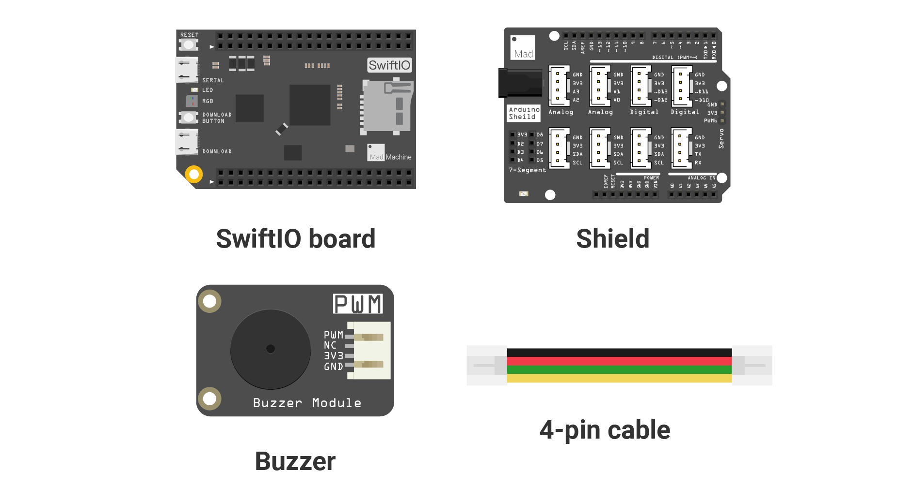

# Mission12\_Buzzer\_Music

In this project, let's play a known song Twinkle twinkle little star using a buzzer.

## What you need



## Circuit

### Circuit diagram


### Build your circuit

Place the shield on the top of your SwiftIO board. 

Connect **buzzer** module to pin **PWM2B** \(D10\).

## Example code

You could open the code in the  &gt; MakerKit &gt; Mission12\_Buzzer\_Music.

```swift
// Import the SwiftIO library to use everything in it.
import SwiftIO

// Import the board library to use the Id of the specific board.
import SwiftIOBoard

// Import this library to set the PWM signal according to the musical notes.
import PWMTone

var halfStep = 0
// BPM, beat per minute, measures the tempo of music.
var bpm = 60
// Initialize a player.
let player = PWMTone(PWMOut(Id.PWM2B), bpm: bpm)

while true {
    // Play the music. 
    player.play(track: Music.twinkle)

    // Increase the bpm to make the music faster.
    bpm += 40
    player.setBPM(bpm)

    // Raise an octave and the pitch sound higher.
    halfStep += 12
    player.setFixedHalfStep(halfStep)

    sleep(ms: 1000)
}
```

## What you'll see

After you successfully download the code, you will hear the melody from the buzzer. The music will gradually become faster and the pitch will become higher.

## Background: about musical notes

Before coming to the code, you will need to know something about the notes.

There are 88 keys in total on a piano keyboard, from A0 to C8. These notes correspond to different **frequencies**. 

A **half step**, or semitone, is the smallest interval between notes, for example, the interval between the key A and key A\# is a half step. Two half steps constitute a whole step, like the interval between A and B. 

An octave consists of 12 half steps. It is the distance between a note and the next note with the same name, for example, the first key A to the second key A forms an octave.


A **quarter note** is the common note length in music and has one **beat**. Then the other notes are based on it: a half note has two beats, a whole note has four beats, an eighth note has half of the beat, etc.

**BPM**, or beat per minute,  is used to measure the tempo of a piece of music. For example, 60 BPM means there would be 60 beats in a minute and each beat lasts 1 second.

## Code Analysis

You could find two files in the project. The file `Twinkle.swift` records the notes of the melody and the duration of each note. Let's take a look at the file `main.swift`. You will set the PWM signal to play the music.

```swift
import SwiftIO
import SwiftIOBoard
import PWMTone
```

SwiftIO and SwiftIOBoard are the libraries used in all these projects. 

And you will use another library [PWMTone](https://github.com/madmachineio/PWMTone/blob/main/Sources/PWMTone/PWMTone.swift). It allows you to set the PWM in accordance with the musical score. 

```swift
var halfStep = 0
```

The value `halfStep` is used to the change of the pitch. It equals 0, so the pitch remains unchanged.

```swift
var bpm = 60
```

Set the bpm to 60, so each beat will last one second.

```swift
let player = PWMTone(PWMOut(Id.PWM2B), bpm: bpm)
```

Initialize the player. It has three parameters: 

* The first one is the PWM pin, 
* The second is the bpm, 
* The third one sets the interval between each note, it equals 0.1 by default.

```swift
player.play(track: Music.twinkle)
```

This statement is to play the music. 

The method `play(track:halfstep)` has two parameters. 

* The `track` is an array of tuples that indicates notes and note length. `Music.twinkle` refers to the score written in the file `Twinkle.swift`. The struct Music has a constant `twinkle` that stores the notes and the note length. So the track is written as `Music.twinkle`. 
* The `halfStep` has a default value of 0. You will set it later. So you could ignore it here. 

```swift
bpm += 40
player.setBPM(bpm)
```

Then increase the bpm to make the tempo a little faster. This increment is a random number you prefer.

```swift
halfStep += 12
player.setFixedHalfStep(halfStep)
```

These two statements aim to raise an octave, so the pitch of the music sounds higher.

