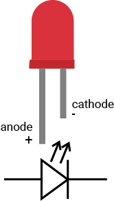

# Mission2\_RGB\_LED

In this mission, you will try to build the circuit and turn on three LEDs one by one.

## What you need


## Circuit


Each upper or lower five sockets on your breadboard are shorted vertically. 


So place three LEDs on the different columns. 

The long leg of each LED is connected to a digital pin: **red** LED connects to **D16**, **green** LED connects to **D17**, **blue** LED connects to **D18**. 

The short leg is connected to a 1k ohm resistor and goes to the pin GND. 

## Example code

You could open the code in the  &gt; MakerKit &gt; Mission2\_RGB\_LED.

```swift
// Import the SwiftIO library to use everything in it.
import SwiftIO

// Import the board library to use the Id of the specific board.
import SwiftIOBoard

// Initialize three LEDs.
let red = DigitalOut(Id.D16)
let green = DigitalOut(Id.D17)
let blue = DigitalOut(Id.D18)

while true {
    // Turn on red LED for 1 second, then off.
    red.write(true)
    sleep(ms: 1000)
    red.write(false)

    // Turn on green LED for 1 second, then off.
    green.write(true)
    sleep(ms: 1000)
    green.write(false)

    // Turn on blue LED for 1 second, then off.
    blue.high()
    sleep(ms: 1000)
    blue.low()
}
```

## What you'll see

As the code is downloaded to your board, the red, green, and blue LED blink one after another. Each LED will be on for 1s.

## LED

Before start, let's talk about the LED \(Light Emitting Diodes\). It is has a positive leg \(anode\) and a negative leg \(cathode\). The long leg is positive and the short leg is negative.

The current could only flow in one direction, from positive to negative. You should connect the positive leg to the current source.



## Code analysis

First, import the two libraries: `SwiftIO` and `SwiftIOBoard`.

In this project, you connect three LEDs to the SwiftIO board. So you need to initialize the three output pins: D16, D17, and D18.

In the loop, the pin outputs a high voltage to light the LED. Each of the three LEDs connects to the digital pin and ground. So contrary to the onboard LED, they will be on as you apply high voltage. After 1s, turn off the LED by applying low voltage. The next LED turns on immediately and repeats the process above. Thus three LEDs blink in turns.

## See also

\*\*\*\*[**DigitalOut**](https://swiftioapi.madmachine.io/Classes/DigitalOut.html) - this class is used to decide whether the pin output high or low voltage.

`init(_:mode:value:)` - initialize the digital output pin. The first parameter needs the `id`. It is listed in the [Id enumeration](https://swiftioapi.madmachine.io/Enums/Id.html). The parameters mode and value have already their default value.

`write(_:)` - set a specific pin to output high or low voltage. Its parameter is a boolean type: `true` or `false`. `true` corresponds to a high level and `false` corresponds to a low level.

[`sleep(ms:)`](https://swiftioapi.madmachine.io/Functions.html#/s:7SwiftIO5sleep2msySi_tF) - suspend the microcontroller's work and thus make the current state last for a certain time, measured in milliseconds.

