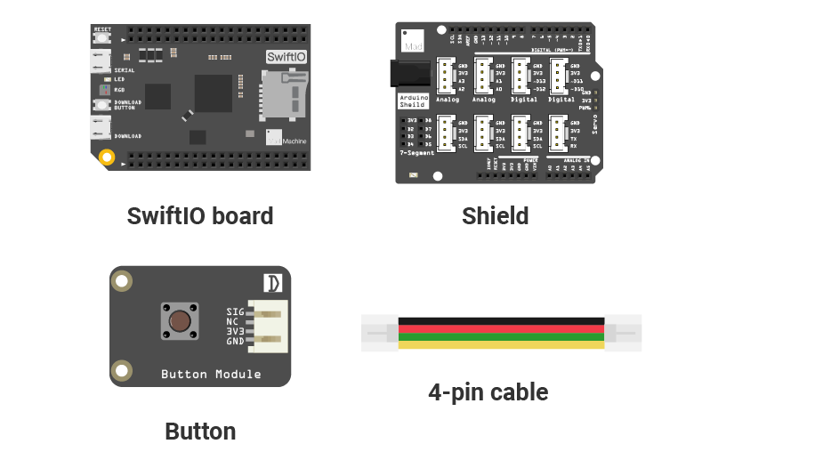

# Mission3\_Push\_Button

In the two previous projects, the LED turns on and off automatically. Now, you will control the LED yourself using a pushbutton.

## What you need



## Circuit


The shield is a modular circuit board that makes it easier to connect the circuit. The pins on the two sides of the shield are the same as those on the SwiftIO board. Besides, it has many grove connectors, so you could use a 4-pin cable to connect the pin instead of four jumper wires.

Place the shield on the top of your SwiftIO board. Make sure you connect them in the right direction. 

Connect the **button** module to pin **D10** using a 4-pin cable. You could notice each cable has four colors of wires: the black is usually for ground, the red one is for power. Ok, the circuit is finished. It is really convenient, isn't it?

## Example code

You could open the code in the  &gt; MakerKit &gt; Mission3\_Push\_Button.

```swift
// Import the SwiftIO library to use everything in it.
import SwiftIO

// Import the board library to use the Id of the specific board.
import SwiftIOBoard

let led = DigitalOut(Id.RED) // Initialize the red onboard led.
let button = DigitalIn(Id.D10) // Initialize an input pin D10 on board.

while true {

    // Read the button value. If it is pressed, turn on the led.
    if button.read() {
        led.write(false)
    } else {
        led.write(true)
    }

    sleep(ms: 10)
}
```

## What you'll see

As you download the code to your board, the red LED is off. If you press the button, the LED turns on. Once you release the button, the LED turns off.

## Button

The button or pushbutton is always used to control other devices, like the light switch, or your remote control. This button is momentary, its state will only change as you press it.

This kind of button usually has four legs. The two legs on the same side are shorted as the following image:


So when you connect a single button, it's better to connect the two legs on a diagonal line.

While the button module in your kit uses the grove connector, and you could directly build the circuit without worrying about the wrong connection.

Also, there is a known issue with the button: the bounce. You could turn to the [debounce](../simpleio/debounce.md#debounce) tutorial. The button module uses the hardware debounce method, so you will not meet with this issue. 

## Code Analysis

First, import the two libraries: `SwiftIO` and `SwiftIOBoard`.

Initialize the red onboard LED and the digital pin \(D10\) the button connects to. 

In the loop, you will use the `if-else` statement to check the button states. An if-else statement has the following form:

```swift
if condition {
    statement1
} else {
    statement2
}
```

The condition has always two results, either true or false. If it is true, statement1 will be executed; if it's false, statement2 will be executed.

`button.read()` will return the input value. If the button is pressed, the value will be true, so the pin output a low voltage to turn on the onboard LED. Once you release the button, the input value is false, the LED will turn off.

## See also

[`DigitalIn`](https://swiftioapi.madmachine.io/Classes/DigitalIn.html) - this class is used to read the input voltage on a specific pin, to know it is high or low level.

`read()` - this method allows you to get the value. The return value is either `true` or `false`.

