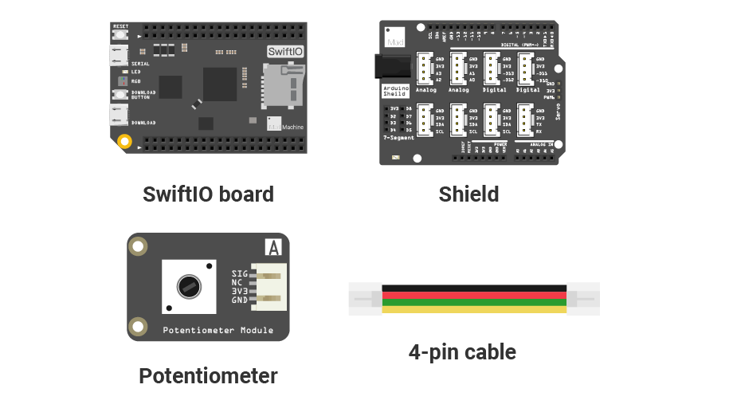
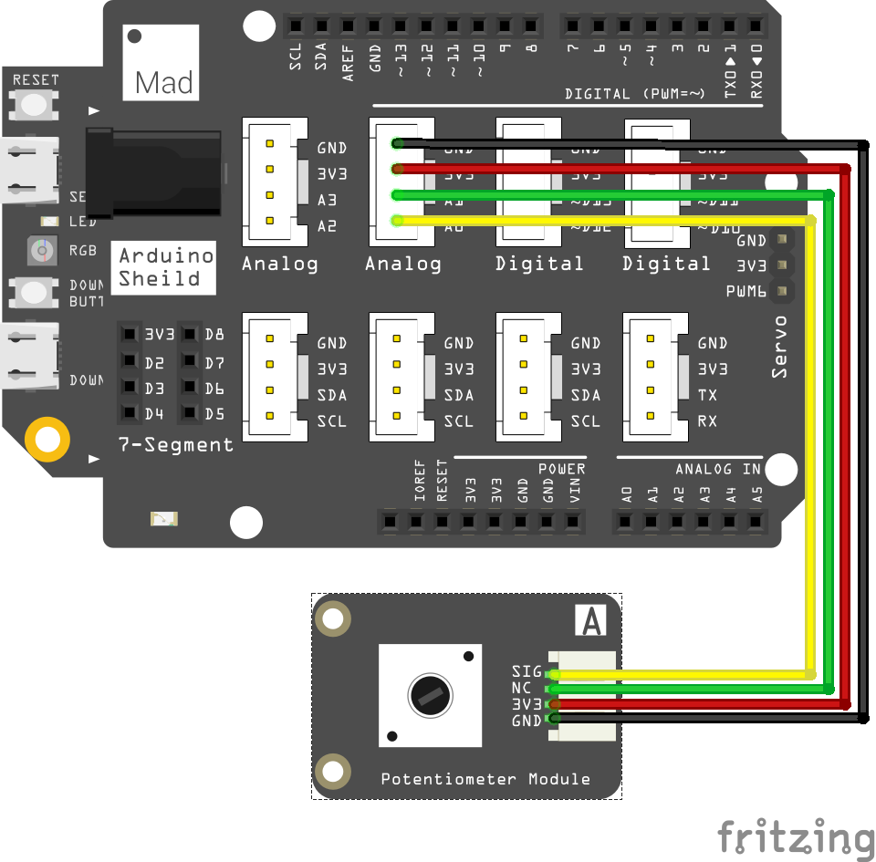
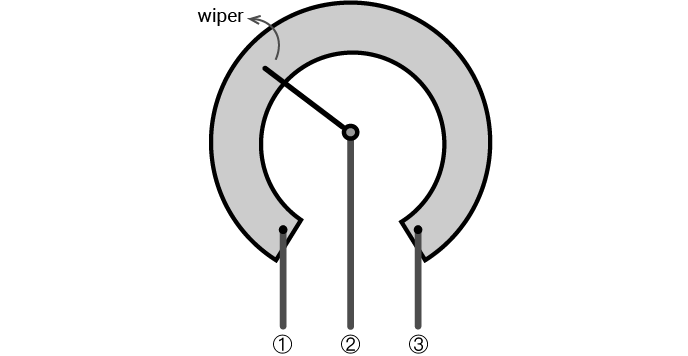
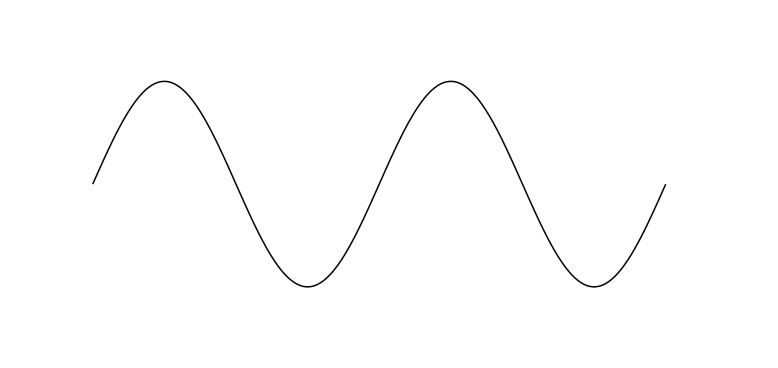

# Mission4\_Potentiometer\_RGB

In this project, you'll turn a potentiometer to control the LED blink rate.

## What you need



## Circuit



Place the shield on the top of your SwiftIO board. 

Connect the **potentiometer** module to pin **A0** using a 4-pin cable. 

## Example code

You could open the code in the  &gt; MakerKit &gt; Mission4\_Potentiometer\_RGB.

```swift
// Import the SwiftIO library to use everything in it.
import SwiftIO

// Import the board library to use the Id of the specific board.
import SwiftIOBoard

let a0 = AnalogIn(Id.A0) // Initialize an AnalogIn pin A0.
let led = DigitalOut(Id.RED) // Initialize the red onboard led.

while true {
    led.toggle()

    // Return the percentage of the voltage in the range of 0.0 to 1.0.
    let analogValue = a0.readPercent()
    let delayTime = Int(analogValue * 500)

    // Stop the program for a certain period based on the value to keep current led state.
    sleep(ms: delayTime)
}

```

## What you'll see

After you download the code, as you turn the potentiometer, the LED blinks faster or slower.

## Potentiometer

The potentiometer is one kind of variable resistor. You could adjust its resistance by rotating it clockwise or anticlockwise. 



The resistance between ① and ③ is its maximum value. The wiper divides it into two parts. As the wiper moves, the resistance of the two parts will change accordingly. 

## Background: what is an analog signal?



In the previous project, you know that the digital signal has determined values. The **analog signal** is quite different. Its voltage always changes smoothly with time. The value ranges in a certain range, between 0V and 3.3V. So you could get 1.5V, 2V... There could be infinite possible values.

So how could you read its value? Here comes the analog to digital converter. It converts the analog voltage to a digital value that the microcontroller could read. It has different precision. The **resolution** is used to describe the possible values it could measure. The SwiftIO board is 12-bit resolution, which means there are 4096 \(0-4095\) values in total. The value from 0 to 4095 is known as a **raw value**.

Let's see the working process for analog to digital conversion. When the board reads from the analog pin, it will first get a raw value between 0 and 4095. Then this value could be converted to voltage value proportionally. Here is the formula:


For example, if the raw value equals 0, the voltage would be 0V; if the raw value equals 4095, the voltage would be 3.3V; and 2047 corresponds to 1.65V.

## Code Analysis

First, import the two libraries: `SwiftIO` and `SwiftIOBoard`.

Initialize the red onboard LED and the analog pin \(A0\) the potentiometer connects to. 

In the loop, `toggle()` is used to reverse the digital output voltage. If the present voltage is high, then it will be changed to low, and vice versa. `led.toggle()` will change the state of the onboard LED automatically, and you don't need to know if the LED is on or off.

`a0.readPercent()`  allows you to get the input voltage in percentage. It represents the ratio between the raw value and the resolution \(4096\).  

The blink rate is decided by sleep time. Then this time is related to the input value. In this way, the potentiometer could control the LED.

## See also

[`AnalogIn`](https://swiftioapi.madmachine.io/Classes/AnalogIn.html) - this class is used to get the analog input value.

`readPercent()` - this method allows you to read the input value and return the value in a percentage.

