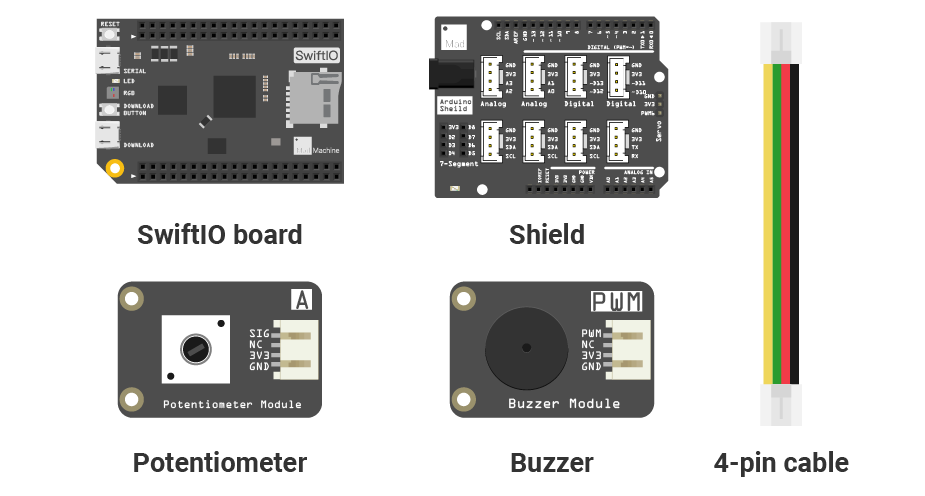
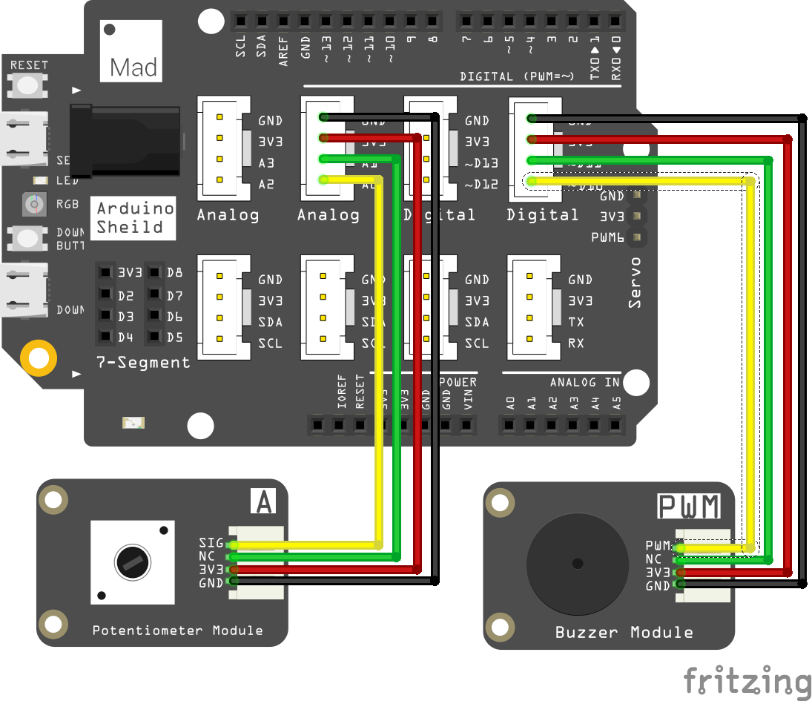

# Mission5\_Buzzer

In this project, you will get a buzzer buzzing. And its sound will change as you turn the potentiometer.

## What you need



## Circuit

### Circuit diagram



### Build your circuit

Place the shield on the top of your SwiftIO board. 

Connect the **potentiometer** module to pin **A0** using a 4-pin cable. 

Connect **buzzer** module to pin **PWM2B** \(D10\).

## Example code

You could open the code in the  &gt; MakerKit &gt; Mission5\_Buzzer.

```swift
// Import the SwiftIO library to use everything in it.
import SwiftIO

// Import the board library to use the Id of the specific board.
import SwiftIOBoard

let a0 = AnalogIn(Id.A0)

// PWM, also known as Pulse Width Modulation is a type of digital signal.
// The PWM signal can be used to configure a servo, or to control the dimming of a LED light.
// Initialize a PWM output pin.
let buzzer = PWMOut(Id.PWM2B)

while true {
    // Read the input voltage.
    let value = a0.readPercent()
    
    //let value = a0.readPercent()
    let frequency = Int(400 + 2000 * value) // calculate the float value into Int type to serve as frequency.
    buzzer.set(frequency: frequency, dutycycle: 0.5) // Set PWM parameters.
    sleep(ms: 20) // Set the duration of the notes.
}
```

## What you'll see

Rotate the potentiometer, and the pitch of the buzzer gradually goes up or go down.

## Buzzer

The buzzer could produce sound as you apply voltage to it. There is a diaphragm inside the buzzer, and it would vibrate in response to the voltage. It thus vibrates the surrounding air and thus, generates the sound.

There are two kinds: active buzzer and passive buzzer. 

* The active buzzer could produce sounds as you connect it to 3V3 since it has an internal circuit that could alternate the current. 
* The passive buzzer needs a PWM signal. And if its frequency is higher, the pitch it produces would be higher. The buzzer in the kit is the passive one.

## Background: what is a PWM signal?

Pulse Width Modulation \(PWM\) can simulate analog results digitally. Digital control is used to create a square wave, a signal that switches between on and off. The duration of the "on-time" is called the **pulse width**. By changing the ratio of the on-time to the off-time, it will simulate the voltage between fully open \(3.3 volts\) and off \(0 volts\).  

For example, if you repeat this switching pattern with LEDs fast enough, the signal seems to be a stable voltage between 0V and 3.3V. And the LED would show different brightness.

Now come more concepts. A fixed time **period** consists of on and off time. The duration or period is the inverse of the PWM **frequency**. For example, when the PWM frequency is 500 Hz, one period is 2 milliseconds.

The **duty cycle** is the percentage of on-time of output signal during one period. Its range is 0-1. 1 means the output is always on. 0 means the output is always low. And the signal with a 0.5 duty cycle is on for 50% of the time and off for 50% of the time.


## Code Analysis

First, import the necessary libraries for this project: `SwiftIO` and `SwiftIOBoard`.

Initialize the analog pin \(A0\) the potentiometer connects to and the PWM pin \(PWM2B\) the buzzer connects to.

Since you don't want the control to be available only once, you write the code in the loop `while true`. 

Read the analog value in percentage and store it in the constant `value`. 

Then set the PWM signal. You will need `set(frequency:dutycycle:)`. This method has two parameters: frequency and duty cycle.

Its frequency is related to the analog value above. While the `value` is too small to be used as a frequency, so you do some calculation here. The duty cycle doesn't really matter in this project, and you could set it to 0.5 here. And each pitch will last about 20ms.

## See also

[`PWMOut`](https://swiftioapi.madmachine.io/Classes/PWMOut.html) - this class allows you to set the PWM output signal. You could set the on-time of the signal to get an average voltage between 0 and 3.3V.

`set(frequency:dutycycle:)` - this method is used to set the frequency and duty cycle of the PWM signal.

