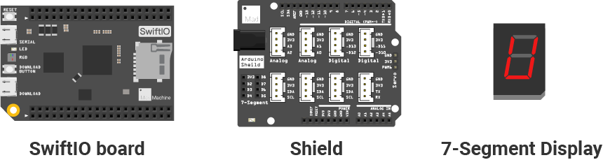
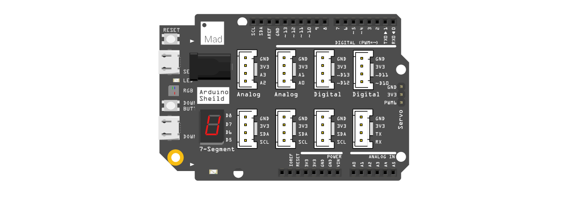

# Mission6\_Seven\_Segment\_Display \(editing\)

## What you need



## Circuit

### Circuit diagram



### Build your circuit

Place the shield on the top of your SwiftIO board. 

Connect the **7-segment** display to pins reserved for it on the shield.

## Example code

You could open the code in the  &gt; MakerKit &gt; Mission6\_Seven\_Segment\_Display.

In the file `SevenSegment.swift`:

```swift
// Import the SwiftIO library to use everything in it.
import SwiftIO
// Import the board library to use the Id of the specific board.
import SwiftIOBoard

final class SevenSegment {
    // Initialize the seven digital pins which are connected to the segment pins.
    static let a = DigitalOut(Id.D8)
    static let b = DigitalOut(Id.D7)
    static let c = DigitalOut(Id.D6)
    static let d = DigitalOut(Id.D5)
    static let e = DigitalOut(Id.D4)
    static let f = DigitalOut(Id.D2)
    static let g = DigitalOut(Id.D3)
    
    
    let leds = [a, b, c, d, e, f, g]
    // Use a binary data to store the status of each segment for the number from 0 to 9.
    // For each data, the last bit represents A and the second bit represents G.
	let ledState: [UInt8] = [
            0b00111111, 0b00000110, 0b01011011, 0b01001111, 0b01100110, 
            0b01101101, 0b01111101, 0b00000111, 0b01111111, 0b01101111
        ]
    
    public func print(_ number: Int) {
        let num = number % 10
        let value = ledState[num] 
        
        // Get the value of each bit to determine whether the relevant segment is on or off.
        for i in 0..<7{
            let state = (value >> i) & 0x01
            if state == 0 {
                leds[i].write(true)
            } else {
                leds[i].write(false)
            }   
        }

    }
}
```

In the file `main.swift`:

```swift
// Import the SwiftIO library to use everything in it.
import SwiftIO

// Import the board library to use the Id of the specific board.
import SwiftIOBoard

let number = 6
let sevenSeg = SevenSegment()

while true {
    sevenSeg.print(number)

}
```

## What you'll see

After the code is successfully downloaded, the 7-segment display shows the number 6. You could try to display other numbers on it.

## 7-segment display


## Code Analysis


