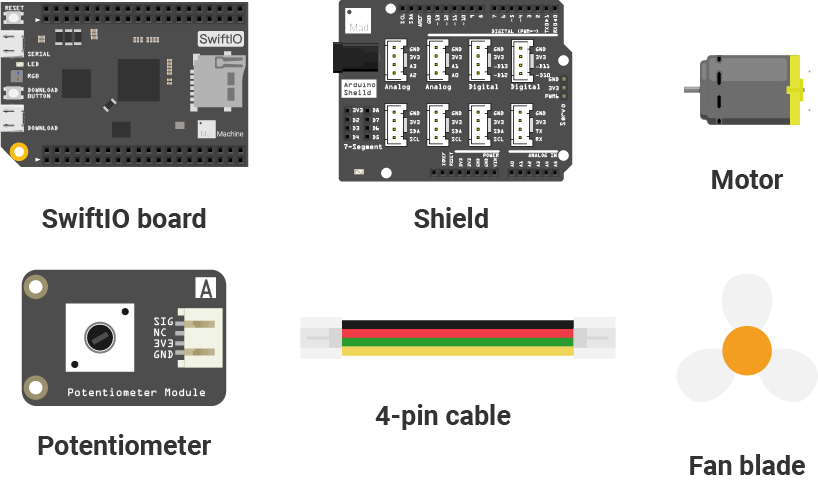
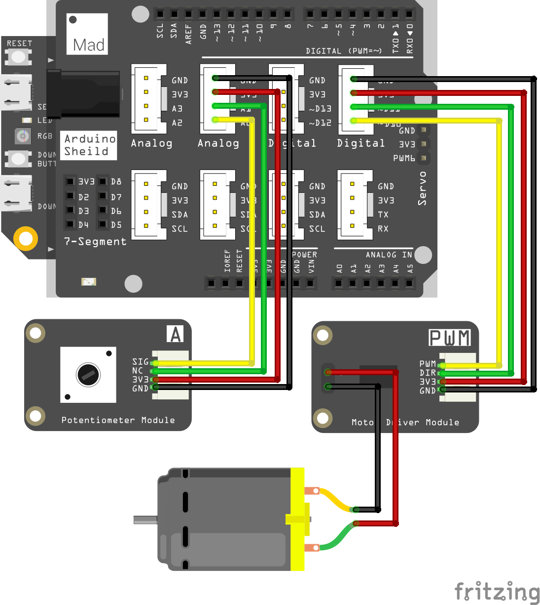

# Mission7\_DC\_Motors \(editing\)

## What you need



## Circuit

### Circuit diagram



### Build your circuit


## Example code

You could open the code in the  &gt; MakerKit &gt; Mission7\_DC\_Motors.

```swift
// Import the SwiftIO library to use everything in it.
import SwiftIO

// Import the board library to use the Id of the specific board.
import SwiftIOBoard

// Initialize the analog pin and the PWM pin 
let a0 = AnalogIn(Id.A0)
let motor = PWMOut(Id.PWM2B)

while true {
    // Read the input value and use it to set the duty cycle of pwm.
    let value = a0.readPercent()
    motor.setDutycycle(value) 
    sleep(ms: 50)
}

```

## What you'll see

## DC motors


## Code Analysis


## See also


