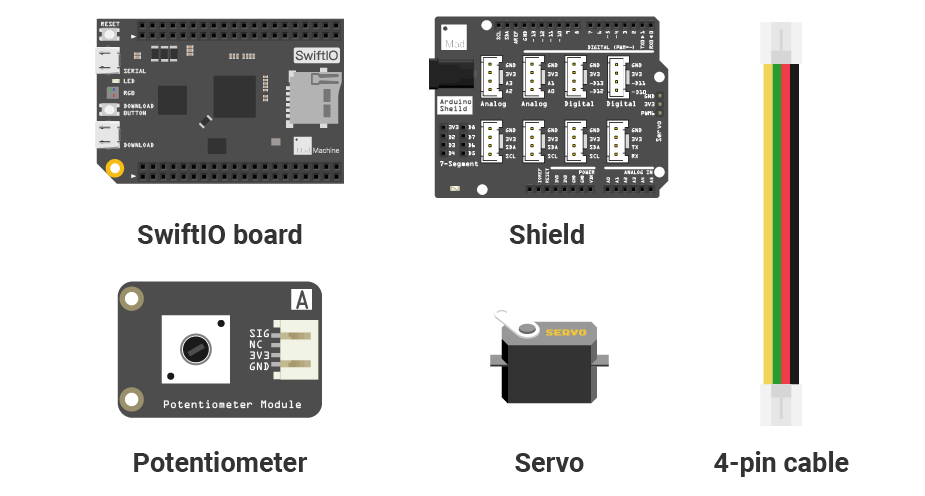
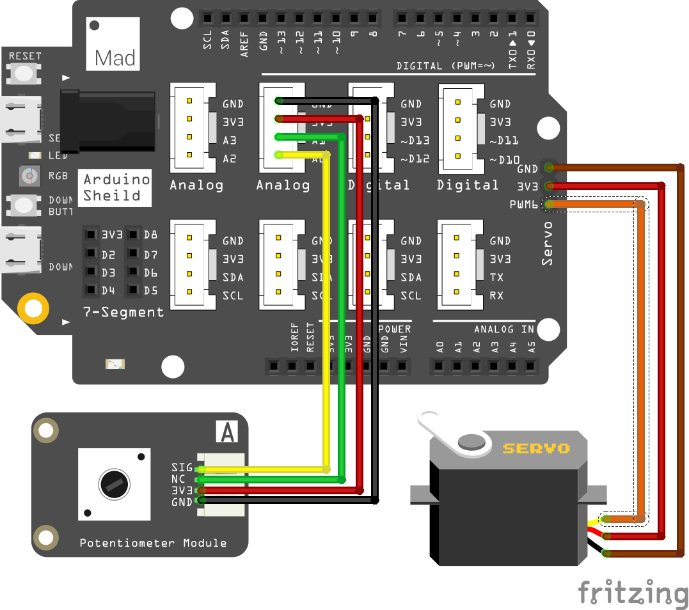

# Mission8\_Servo\_Motor

In this mission, you will use another kind of motor, the servo motor. 

## What you need



## Circuit

### Circuit diagram



### Build your circuit

Place the shield on top of your SwiftIO board. 

Connect the **potentiometer** module to pin **A0** using a 4-pin cable. 

Connect the servo to the pin PWM4A. The servo has three wires: the ground wire is brown, the power wire is red and the signal wire is orange.

## Example code

You could open the code in the  &gt; MakerKit &gt; Mission8\_Servo\_Motor.

```swift
// Import the SwiftIO library to use everything in it.
import SwiftIO

// Import the board library to use the Id of the specific board.
import SwiftIOBoard

let a0 = AnalogIn(Id.A0) // Initialize the analog pin.
// Each cycle of the signal lasts for 20 milliseconds.
// The pulse should last between 0.5 and 2.5 milliseconds to activate the servo.
// With a 0.5ms pulse, the servo will turn to 0 degrees and with a 2.5ms pulse, it will at 180 degrees.
// In between, it is at an angle between 0–180.
let servo = PWMOut(Id.PWM4A)

while true {
    let value = a0.readPercent() // Read the analog value and return a value between 0.0 and 1.0.
    let pulse = Int(500 + 2000 * value) // Calculate the value to get the pulse duration.
    servo.set(period: 20000, pulse: pulse) // Set the servo position according to the scaled value.
    sleep(ms: 20)
}

```

## What you'll see

As you turn the potentiometer, the servo arm will move to a different angle.

## Servo motor

The servo motor could adjust its arm's position according to the signal. You could set PWM output to control it. This servo requires a pulse every 20ms. And the duration of each pulse determines the position of the arm:

* If the high voltage lasts for 0.5ms, the arm will be at 0 degrees.
* If the high voltage lasts for 2.5ms, the arm will be at 180 degrees.
* If the high voltage lasts for 1.5ms, the arm will be at 90 degrees.


_Note: this servo needs the pulse to be in the range of 0.5 to 2.5ms. You may also meet other servos that need the pulse in 1 to 2ms._

## Code Analysis

Import the two libraries: `SwiftIO` and `SwiftIOBoard`.

Initialize the analog pin A0 for the potentiometer and the PWM pin PWM4A for the motor.

In the dead loop, read the input value in percentage, so you get a value between 0 and 1. 

You will use this method `set(period:pulse:)` to set the PWM. The period is measured in microseconds, so it is 20000us. The pulse should be the number between 0.5ms to 2.5ms. So the `value` will be matched into this range by doing some calculations.


