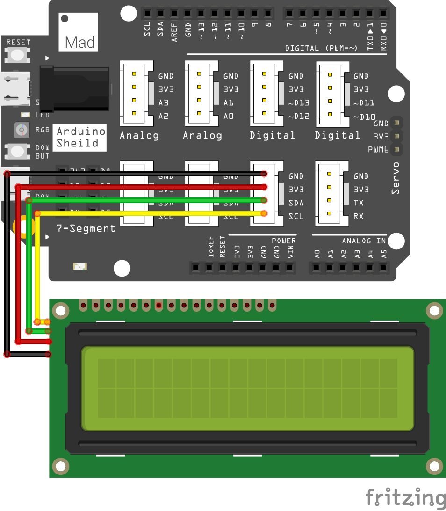
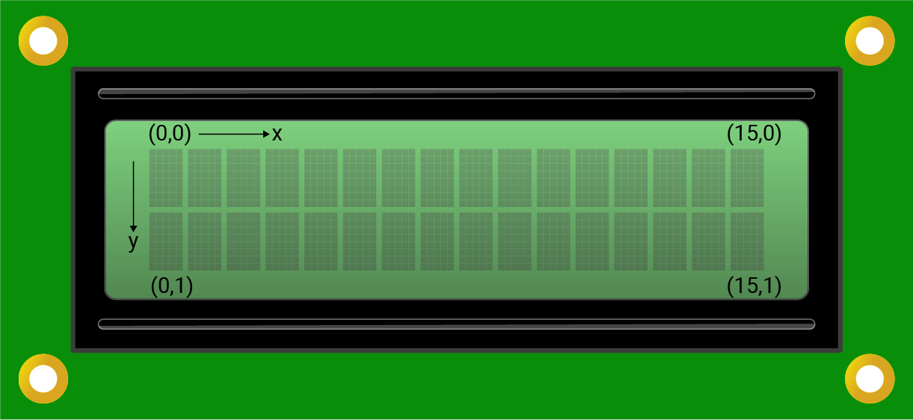
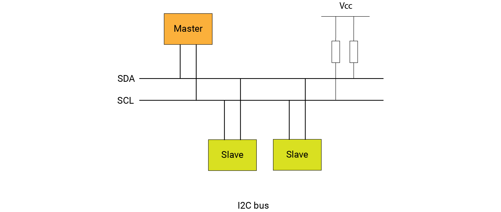

# Mission9\_LCD

If you want to show the messages or display data, the LCD is a great choice. You could find various LCDs. In this mission, you will look at a 16x2 character LCD. Let's display the phrase "Hello World" on it.

## What you need


## Circuit

### Circuit diagram



### Build your circuit

Place the shield on top of the SwiftIO board. 

Connect the LCD to the pins **I2C0**. You could see there are three available I2C0. You could choose any of them.

## Example code

You could open the code in the  &gt; MakerKit &gt; Mission9\_LCD.

In the file `main.swift`:

```swift
// Import the SwiftIO library to use everything in it.
import SwiftIO

// Import the board library to use the Id of the specific board.
import SwiftIOBoard

// Initialize the I2C0 and the lcd.
let i2c = I2C(Id.I2C0)
let lcd = LCD1602(i2c)

// Set the display area and print the message on the LCD.
lcd.write(x: 0, y: 0, "Hello World!")

while true {

}
```

## What you'll see

After you download the code, the screen displays the words "Hello World!".

## 16x2 LCD

This kind of LCD has 16 columns and 2 rows. So it could display 32 characters. Each character consists of 5 columns and 8 rows, that is, 40 pixels. 

In its coordinate system, the upper left corner is the origin \(0,0\). The coordinates of all characters are as below: 



This LCD supports I2C communication. All the commands to control it are in its datasheet. But you don't need to worry about it. You could find the file `LCD1602.swift` in your project. It has done the work for you, you could directly use the methods to control your LCD.

## Background: what is I2C communication?

Inter-integrated circuit, **I2C** \(I two C or I squared C\) for short, is a protocol suitable for short-distance communication. It allows multiple slave devices to communicate with one master device using merely two wires, which constitutes its huge advantage compared to other protocols. 

For the communication protocols, there are always master and slave devices. **Master** device controls the communication process. **Slave** devices would respond to the master when it’s called. In our project, the SwiftIO board is always the master, and the other devices serve as slaves.



The two wires contain an SCL and an SDA line:

* **SCL** \(serial clock\) carries the clock signal generated by the master. With a preset speed, the devices know the time to transmit each bit and could predict if the data transmission is completed. Thus, it could ensure synchronous data transmission between devices. 
* **SDA** \(serial data\) is the data line. All the data is transferred on this line by master or slave devices. And the data is usually in bytes. Each communication protocol specifies its own system about how the data is sent. We'll not talk much about it here.

Why could only two wires support multiple devices without confusion? This is because each I2C device has its unique **address**. You could always find it in its datasheet. At the beginning of the communication, the master will send the address of the device that is wanted. Only the corresponding device would respond and prepare for the following process. Thus there won’t be confusion among different devices.

In brief, if you want to communicate with some devices, you need to find the corresponding data of the command in the datasheet, then send the data according to the rules of communication protocol. 

## Code Analysis

The file [`LCD1602.swift`](https://github.com/madmachineio/MadExamples/blob/main/MakerKit/Mission9_LCD/Sources/Mission9_LCD/LCD1602.swift) has configured the LCD according to its datasheet. It is included in the project, so you could directly use these methods to control your LCD

Let's look at the file `main.swift`. 

Import the necessary libraries. Initialize the I2C interface. To initialize the LCD, you need to tell the I2C interface and the other parameters have a default value.

```swift
lcd.write(x: 0, y: 0, "Hello World!")
```

Then you will use the method `write(x:y:_:)` to display the string. It has three parameters. At first, you need to set the **coordinate** of the start point. Here you start from the origin \(0,0\). The third parameter is the content you would like to display. It is a **string**. So you add the content within the double quotation marks.

Since the text would always display on the LCD, you could write it above the loop. Even there is nothing on the loop, you need to add it in your code.

## See also

[`I2C`](https://swiftioapi.madmachine.io/Classes/I2C.html) - this class allows you to send and receive data through I2C communication.

