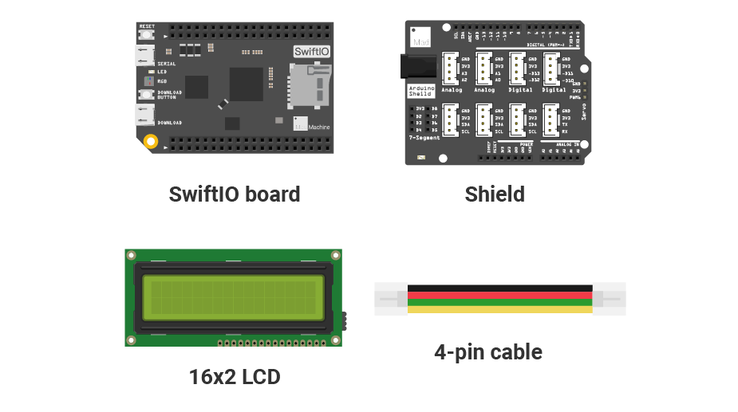

# Mission9\_LCD \(editing\)

## What you need



## Circuit

### Circuit diagram


### Build your circuit


## Example code

You could open the code in the  &gt; MakerKit &gt; Mission9\_LCD.

In the file `main.swift`:

```swift
// Import the SwiftIO library to use everything in it.
import SwiftIO

// Import the board library to use the Id of the specific board.
import SwiftIOBoard

// Initialize the I2C0 and the lcd.
let i2c = I2C(Id.I2C0)
let lcd = LCD1602(i2c)

// Set the display area and print the message on the LCD.
lcd.write(x: 0, y: 0, "Hello World!")

while true {

}
```

## What you'll see

## LCD


## Background: what is I2C communication?


## Code Analysis


## See also


