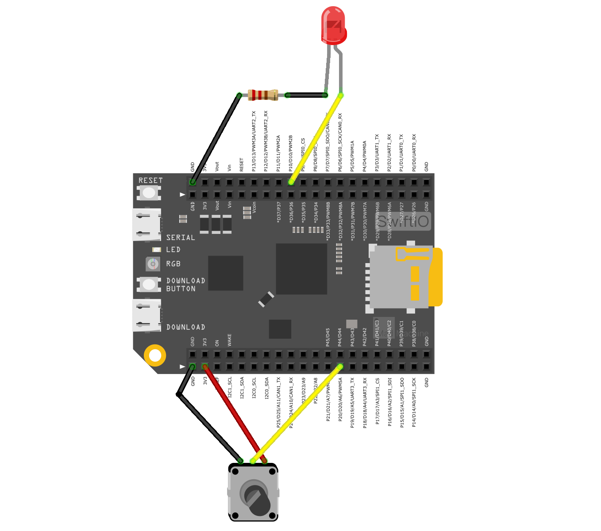
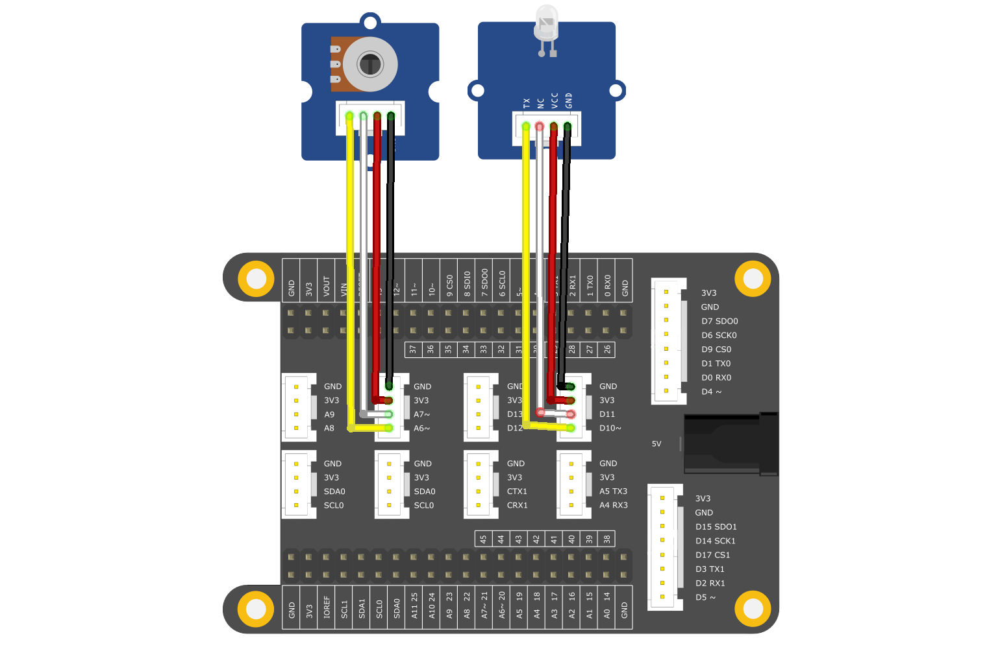
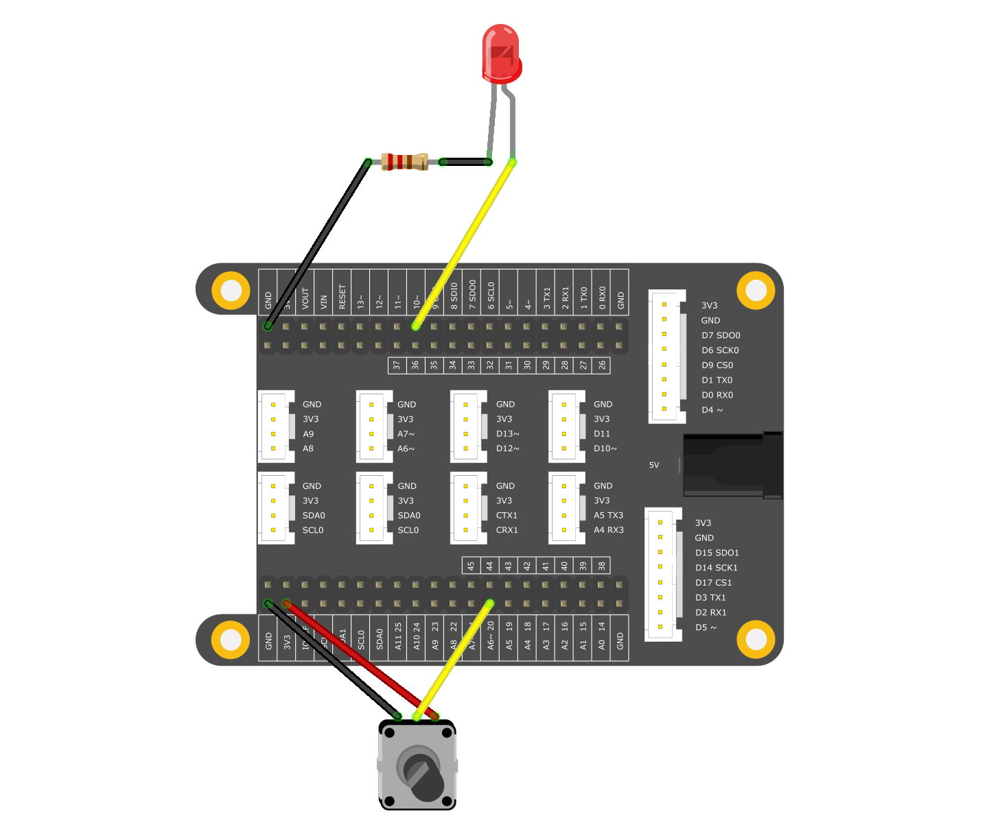

# <span style="color:#EA5823;font-weight:800">BlinkAnalogIn</span>


In this example we use a variable resistor (aka potentiometer) to control the flashing speed of an LED

 We first read its value using an analog input of the SwiftIO board, then using the code below we can change the blink speed accordingly. The resistor's analog value is read as a voltage change, a key character of the analog circuit.

## <span style="color:#EA5823;font-weight:700">What you need</span>
- SwiftIO board
- Jumper wires
- Potentiometer or Module
- LED Module
- SwiftIO shield(optional)
  
#### Kits that meet the experimental conditions: 
- [Maker Kit for SwiftIO](https://www.madmachine.io/product-page/maker-kit-for-swiftio)

## <span style="color:#EA5823;font-weight:700">Circuit</span>




## <span style="color:#EA5823;font-weight:700">Instruction</span>

Prepare the jumper wire cables, notice the female and male ends. Connect the male ends to the SwiftIO board at ports GND，3.3V and P20/A6 ports. 

Connect the P20/A6 wire to the middle pin of the potentiometer. Connect the GND wire to the outer pins of the potentiometer, and the 3.3V wire to the other outer pin of the potentiometer. 

On the LED module, connect jumper wires to GND and SIG ports. Connect the GND wire to the GND port of SwiftIO, and connect the SIG wire to the P10/D10 port.


## <span style="color:#EA5823;font-weight:700">Code</span>


```swift
/// Read the analog input and use it to set the rate of LED blink.

/// Import the library to enable the relevant classes and functions.
import SwiftIO

/// Initialize an analog input and a digital output pin the components are connected to,
let sensor = AnalogIn(Id.A6)
let led = DigitalOut(Id.D10)

/// Enable the LED to blink over and over again.
while true {
    // Read the input voltage in percentage.
    let value = sensor.readRawValue()
    print(value)
    // Change the current LED state.
    led.toggle()
    // Keep the led on or off for a certain period determined by the value you get.
    sleep(ms: value)
}


```
## <span style="color:#EA5823;font-weight:700">A Brief Explanation</span>

By Ohm's law, in a single resistor circuit, the voltage measured across a resistor connected to 3.3V power is always 3.3V, regardless of the resistor's value. To get a voltage proportional to the resistor's value, a resistor divider is added. This circuit uses a variable resistor with 3 legs. By measuring the SIG pin we get the voltage drop values. The voltage measured (Vout) follows this formula:

Vout=Vin*(R2/(R1+R2))

SwiftIO has several 12-bit analog to digital converters(ADC), which means the analog resolution is 12-bit. The function <code>readRawValue()</code> will read and return the current raw value from the specified analog pin, in data type: <code>int</code>.


## <span style="color:#EA5823;font-weight:700">See Also</span>

- [Id](https://swiftioapi.madmachine.io/Enums/Id.html) - Enumerations, public enum Id : UInt32
- [AnalogIn.readRawValue()](https://swiftioapi.madmachine.io/Classes/AnalogIn.html#/s:7SwiftIO8AnalogInC12readRawValueSiyF) - Read the current raw value from the specified analog pin.

## <span style="color:#EA5823;font-weight:700">References</span>

- [Potentiometer](https://en.wikipedia.org/wiki/Potentiometer)
- [Voltage divider](https://en.wikipedia.org/wiki/Voltage_divider)

## <span style="color:#EA5823;font-weight:700">Tips</span>

If you have the optional modules, you can also setup the circuit as shown belown.






---
Last revision 2020/09/04 by Johnson