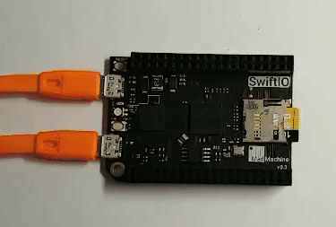

# <span style="color:#EA5823;font-weight:800">BlinkTimer</span>



This example shows how to use the timer and interrupt mechanism of the SwiftIO Board to display the on-board Red LED blinking at a constant period.

## <span style="color:#EA5823;font-weight:700">What you need</span>

- SwiftIO board

#### Kits that meet the experimental conditions: 
- [Maker Kit for SwiftIO](https://www.madmachine.io/product-page/maker-kit-for-swiftio)

## <span style="color:#EA5823;font-weight:700">Circuit</span>


## <span style="color:#EA5823;font-weight:700">Code</span>

```swift
/// Change the LED state every second by setting the interrupt.

/// Import the library to enable the relevant classes and functions.
import SwiftIO

/// Initialize the red onboard LED and a timer to set interrupt.
let red = DigitalOut(Id.GREEN)
let timer = Timer()

/// Raise the interrupt to turn on or off the LED every second.
timer.setInterrupt(ms: 1000) {
    red.toggle()
}

while true {

}
```

## <span style="color:#EA5823;font-weight:700">Instruction</span>

What is a timer?
A timer or more precisely a timer/counter is a piece of hardware built into the SwiftIO board. It is like an alarm clock, and the timer can be programmed through some special registers. You can preset parameters for the timer, which can be triggered by a fixed time interval.

What is an interrupt?
The job of the interrupt is to ensure that the processor responds quickly to important events. When a certain signal is detected, the interrupt will interrupt any operation being performed by the processor and execute some code to respond to any external stimuli fed into the SwiftIO board.

In this example, the timer is set as the internal interrupt source. This is the setInterrupt(ms:1000) method of the Timer() object. The parameter passed in indicates that the timer triggers an interrupt every 1000ms, which is 1s. The toggle() (as the name implies) method of DigitalOut means that the output level is inverted.

The advantage of using this method to achieve timed repetitive events (turning on and off the LED) is that it does not need to use the sleep(ms:) method, and will not occupy the SwiftIO controller, during which it can do other things.

<!--
什么是计时器？
计时器或更确切地说是计时器/计数器是SwiftIO板上内置的一块硬件。它就像一个闹钟，定时器可以通过一些特殊的寄存器进行编程。您可以为计时器预置参数，即可由固定时间间隔进行触发。

什么是中断？
中断的工作是确保处理器对重要事件做出快速响应。当检测到某个信号时，中断会中断处理器正在执行的任何操作，并执行一些代码，以对馈入SwiftIO板的任何外部刺激做出反应。

这个例子中，将定时器设置为内部的中断源，这就是Timer()对象的 setInterrupt（ms:1000）方法，传入的参数表示这个定时器每隔1000ms即1s触发中断。DigitalOut的toggle()（顾名思义）方法表示输出电平进行翻转。

用这种方法实现的定时重复事件（点亮、熄灭LED）的优点在于不必使用sleep(ms:)方法，不会占用SwiftIO控制器，在这期间它可以去做其它事情。

-->


## <span style="color:#EA5823;font-weight:700">See Also</span>
- [Timer()](https://swiftioapi.madmachine.io/Classes/Timer.html) - The Timer class is used to set the occasion to raise the interrupt.
- [toggle()](https://swiftioapi.madmachine.io/Classes/DigitalOut.html#/s:7SwiftIO10DigitalOutC6toggleyyF) - To alternate between two voltagle level.

## <span style="color:#EA5823;font-weight:700">References</span>

- [Timer](https://en.wikipedia.org/wiki/Timer)
- [Interrupt](https://en.wikipedia.org/wiki/Interrupt)
- [toggle](https://en.wiktionary.org/wiki/toggle)


---
Last revision 2020/09/04 by Johnson