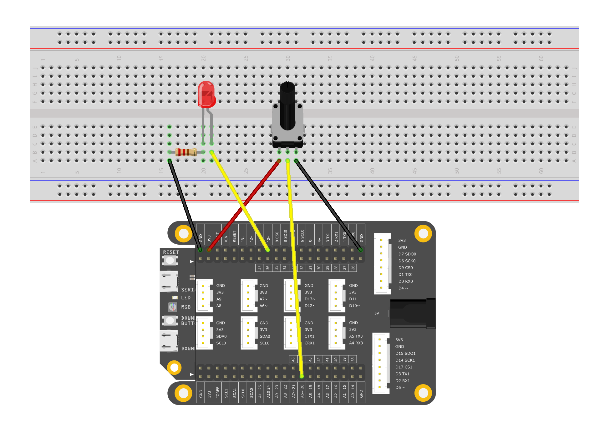
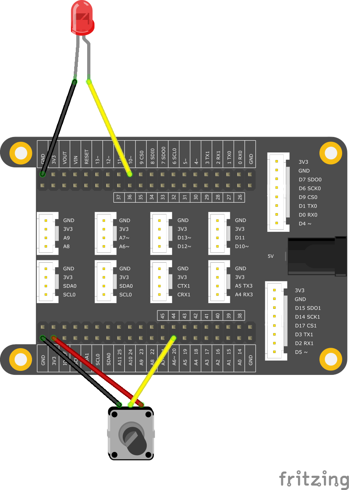

# <span style="color:#EA5823;font-weight:800">BrightnessAnalogIn</span>


This example demonstrates how to use an analog output (pulse width modulation (PWM)) to adjust the brightness of an LED based on the position of the potentiometer. PWM is a technology that obtains a very similar behavior from a digital output, which can be turned off and on very quickly, and the ratio between on and off time is different.

## <span style="color:#EA5823;font-weight:700">What you need</span>

- SwiftIO board
- Jumper wires
- Potentiometer or Module
- LED Module (LED and 10k ohm resistor)
- SwiftIO shield(optional)

#### Kits that meet the experimental conditions: 
- [Maker Kit for SwiftIO](https://www.madmachine.io/product-page/maker-kit-for-swiftio)

## <span style="color:#EA5823;font-weight:700">Circuit</span>



## <span style="color:#EA5823;font-weight:700">Code</span>

```swift
/// Read the analog input value and use it to set the PWM output in order to change the LED brightness.

/// Import the library to enable the relevant classes and functions.
import SwiftIO

/// Initialize an analog input and a digital output pin the components are connected to.
let sensor = AnalogIn(Id.A6)
let led = PWMOut(Id.PWM2B)

/// Allow the LED brightness control all the time.
while true {
    // Read the input voltage in percentage.
    let value = sensor.readPercent()
    // Light the LED by setting the duty cycle.
    led.setDutycycle(value)
    // Keep the current LED state for 200 millisecond.
    sleep(ms: 200)
}
```

## <span style="color:#EA5823;font-weight:700">Instruction</span>

Pulse Width Modulation (PWM) is a technique for obtaining analog results digitally. Digital control is used to create a square wave, a signal that switches between on and off. By changing the ratio of the signal on time to the signal off time, this switch mode can simulate the voltage between fully open (3.3 volts) and off (0 volts). The duration of the "on time" is called the pulse width. To obtain a varying analog value, you can change or modulate the pulse width. For example, if you repeat this switching pattern with LEDs fast enough, the result is as if the signal is a stable voltage between 0 and 3.3v that controls the brightness of the LED.

In the figure below, the red line represents a fixed time period. The duration or period is the inverse of the PWM frequency. In other words, when the PWM frequency is about 500 Hz, the red lines are measured for 2 milliseconds each. The range of calling setDutycycle(value) is 0-1, so setDutycycle(1) requests a 100% duty cycle (always on), and setDutycycle(0.5) is a 50% duty cycle (half the time).


Correspondingly, analogIn's readRawValue() is not called this time, but the corresponding return value range of readPercent() is 0 to 1.

Once you get the example running, grab your SwiftIO board and shake it back and forth. What you are doing here is actually mapping time across the entire space. In our opinion, motion blurs each LED flashing into a line. As the LED fades in and out, the length of these thin lines will increase and decrease. Now you will see the pulse width.

<!--
相应地，这次没有调用AnalogIn的readRawValue（），但相应的readPercent（）返回值范围是0到1。

一旦示例开始运行，请抓住您的SwiftIO板并来回摇动它。 您在这里所做的实际上是在整个空间上映射时间。 我们认为，运动会使每个LED闪烁成一条线而模糊。 随着LED淡入和淡出，这些细线的长度将增加和减少。 现在您将看到脉冲宽度。
-->


## <span style="color:#EA5823;font-weight:700">See Also</span>
- [PWMOut](https://swiftioapi.madmachine.io/Classes/PWMOut.html) - The PWMOut class is used to vary the output voltage

## <span style="color:#EA5823;font-weight:700">References</span>

- [Pulse-width modulation](https://en.wikipedia.org/wiki/Pulse-width_modulation)
- [Duty cycle](https://en.wikipedia.org/wiki/Duty_cycle)
- [Potentiometer](https://en.wikipedia.org/wiki/Potentiometer)
- [Voltage divider](https://en.wikipedia.org/wiki/Voltage_divider)

## Tips




---
Last revision 2020/09/12 by Johnson