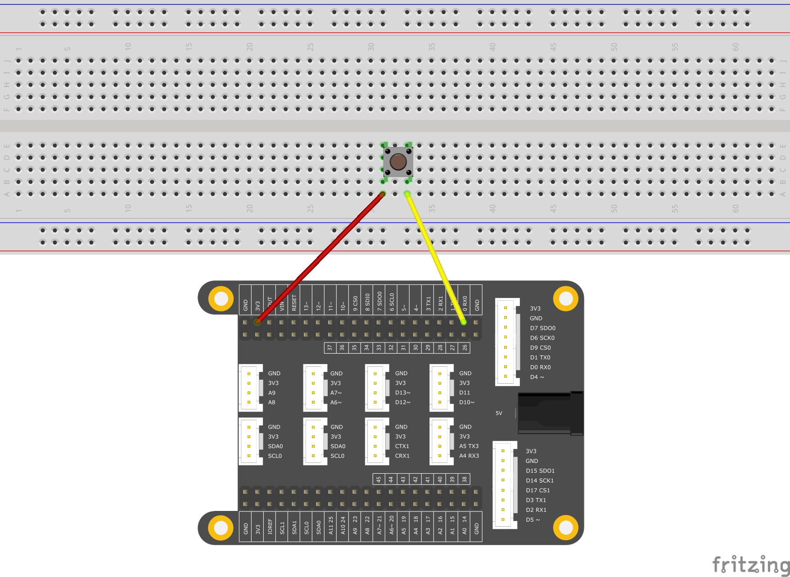

# <span style="color:#EA5823;font-weight:800">Debounce</span>


When we use a push button as a toggle switch, it often generates some flickering effects, due to mechanical and physical limitations. I.e, the processor may recognize the button being pushed several times in a short period of time. This example demonstrates how to debounce an input, which means checking twice in a short period of time to make sure the push-button is definitely being pressed, and only being pressed once.

## <span style="color:#EA5823;font-weight:700">What you need</span>

- SwiftIO board
- button
- wires

## <span style="color:#EA5823;font-weight:700">Circuit</span>



## <span style="color:#EA5823;font-weight:700">Code</span>


```swift
// Check if the button is definitely pressed.

// Import the library to enable the relevant classes and functions.
import SwiftIO

// Initialize the red onboard LED.
let red = DigitalOut(Id.RED)

// Initialize a digital input pin D0 the button is connected to.
let button = DigitalIn(Id.D10, mode: .pullUp)

// Declare the values in order to record and judge the button state.
var count = 0
var triggered = false


while true {
    // Read from the input pin.
    let value = button.read()
    
    // Ignore the change due to the noise.
    if value == false {
        count += 1
    } else {
        count = 0
        triggered = false
    }
    
    // Wait a certain period to check if the button is definitely pressed. 
    // Toggle the LED and then reset the value for next press.
    if count > 50 && !triggered {
        red.toggle()
        triggered = true
        count = 0
    }
    
    // Wait a millisecond and then read to ensure the current state last for enough time. 
    sleep(ms: 1)

}
```

## <span style="color:#EA5823;font-weight:700">Instruction</span>

Swift has a basic Boolean type, called Bool. Boolean values are referred to as logical, because they can be either `true` or `false`. Swift provides two Boolean constant values, true and false. `var triggered` is define as Bool to store whether the DigitalInput is change.

The `DigitalOut` class has `Mode` enumerate includes the available output modes. The default output mode in most cases is `pushPull`. The `pushPull` mode enables the digital pin to output high and low voltage levels while the open-drain output cannot truly output a high level.

Due to mechanical and physical issues, push-buttons often generate spurious open/close transitions when pressed, these transitions may be read as multiple presses in a very short time fooling the program. This example demonstrates how to debounce an input, which means checking twice in a short period of time to make sure the push-button is definitely pressed. Without debouncing, pressing the button once may cause unpredictable results. This code uses the `sleep(ms: 1)` 50 times to keep track of the time passed since the button was pressed.


## <span style="color:#EA5823;font-weight:700">See Also</span>

- [DigitalOut](https://swiftioapi.madmachine.io/Classes/DigitalOut.html) - The DigitalOut class is used to set a High or Low voltage output to a digital output pin. 
- [DigitalOut Mode](https://swiftioapi.madmachine.io/Classes/DigitalOut/Mode.html) - The Mode enumerate includes the available output modes.

## <span style="color:#EA5823;font-weight:700">References</span>

- [Boolean type](https://docs.swift.org/swift-book/LanguageGuide/TheBasics.html)
- [Push–pull output](https://en.wikipedia.org/wiki/Push%E2%80%93pull_output)

## <span style="color:#EA5823;font-weight:700">Tips</span>


---
Last Edit 2020/09/14 by Martin
> Changing words

Last revision 2020/09/10 by Johnson