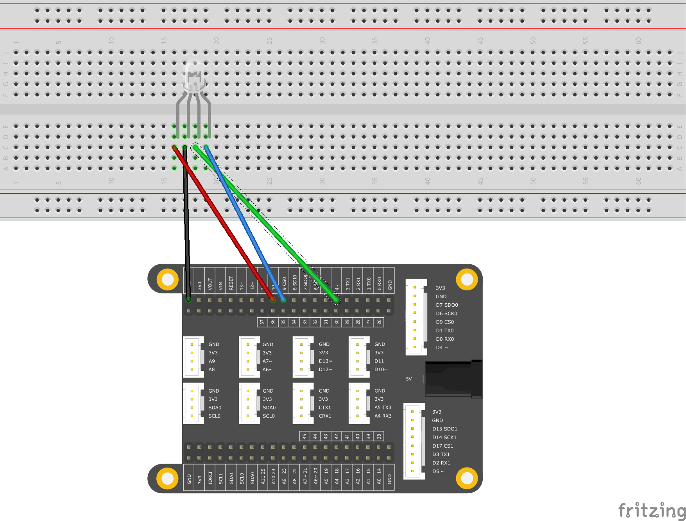

# <span style="color:#EA5823;font-weight:800">LEDsBrightnessControl</span>


## <span style="color:#EA5823;font-weight:700">What you need</span>

- SwiftIO board
- Jumper wires
- Potentiometer or Module
- 3 color LED Modules (3*color LEDs and 3*10k ohm resistors)
- SwiftIO shield(optional)

## <span style="color:#EA5823;font-weight:700">Circuit</span>



## <span style="color:#EA5823;font-weight:700">Tips</span>


## <span style="color:#EA5823;font-weight:700">Code</span>


```swift
/// Change the LED state every second by setting the interrupt.

/// Import the library to enable the relevant classes and functions.
import SwiftIO

/// Initialize the pins the LEDs are connected to and put them in a array.
let red = PWMOut(Id.PWM0A)
let green = PWMOut(Id.PWM1A)
let blue = PWMOut(Id.PWM2B)
let leds = [red, green, blue]

/// Declare a variable to store the value of duty cycle.
var value: Float = 0.0

/// Change the brightness of each LED over and over again.
while true {
    for led in leds {
        // Brighten the LED in two seconds.
        while value <= 1.0 {
            led.setDutycycle(value)
            sleep(ms: 20)
            value += 0.01
        }
        // Keep the value of duty cycle between 0.0 and 1.0.
        value = 1.0
        // Dimming the LED in two seconds.
        while value >= 0 {
            print(value)
            led.setDutycycle(value)
            sleep(ms: 20)
            value -= 0.01
        }
        // Keep the value of duty cycle between 0.0 and 1.0.
        value = 0.0
    }
}

```


## <span style="color:#EA5823;font-weight:700">Video</span>


## <span style="color:#EA5823;font-weight:700">See Also</span>


## <span style="color:#EA5823;font-weight:700">References</span>

---
Last revision 2020/09/10 by Johnson