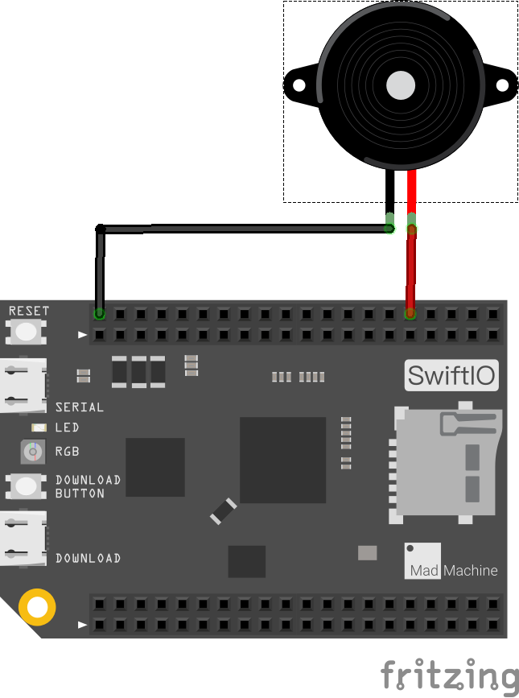

# <span style="color:#EA5823;font-weight:800">PWMSoundOutput</span>


This example shows how to use the `PWMOut` to generate notes. It plays three tones repeatly.

## <span style="color:#EA5823;font-weight:700">What you need</span>

- SwiftIO board
- Jumper wires
- Buzzer
- SwiftIO shield(optional)

## <span style="color:#EA5823;font-weight:700">Circuit</span>




## <span style="color:#EA5823;font-weight:700">Code</span>

```swift
/// Produce different notes by changing the frequency of PWM signal.

/// Import the library to enable the relevant classes and functions.
import SwiftIO

/// Initialize a PWM output pin the speaker is connected to.
let speaker = PWMOut(Id.PWM2B)

/// Specify several frequencies to produce different sound.
let fre = [262, 294, 330]

/// Play recurrently these notes.
while true {
    for f in fre {
        // Set the frequency and the duty cycle of output to produce each note.
        speaker.set(frequency: f, dutycycle: 0.5)
        // Play each note for one second.
        sleep(ms: 1000)
    }
    
}
```

## <span style="color:#EA5823;font-weight:700">Instruction</span>

The code above uses a Frequency as musical pitches. For example, NOTE_C4 is middle C which frequency is 262. Latter example MidiPlayer we will markdown all this muscial note in a file. This file contains all the pitch values for typical notes. You may find it useful whenever you want to make musical notes.

## <span style="color:#EA5823;font-weight:700">See Also</span>

- [PWMOut](https://swiftioapi.madmachine.io/Classes/PWMOut.html) - The PWMOut class is used to vary the output voltage

## <span style="color:#EA5823;font-weight:700">References</span>

- [Frequency and Pitch](http://www.vias.org/crowhurstba/crowhurst_basic_audio_vol1_006.html)
- [Online Tone Generator](https://www.szynalski.com/tone-generator/)
- [Pitch (music)](https://en.wikipedia.org/wiki/Pitch_(music))


---
Last revision 2020/09/10 by Johnson