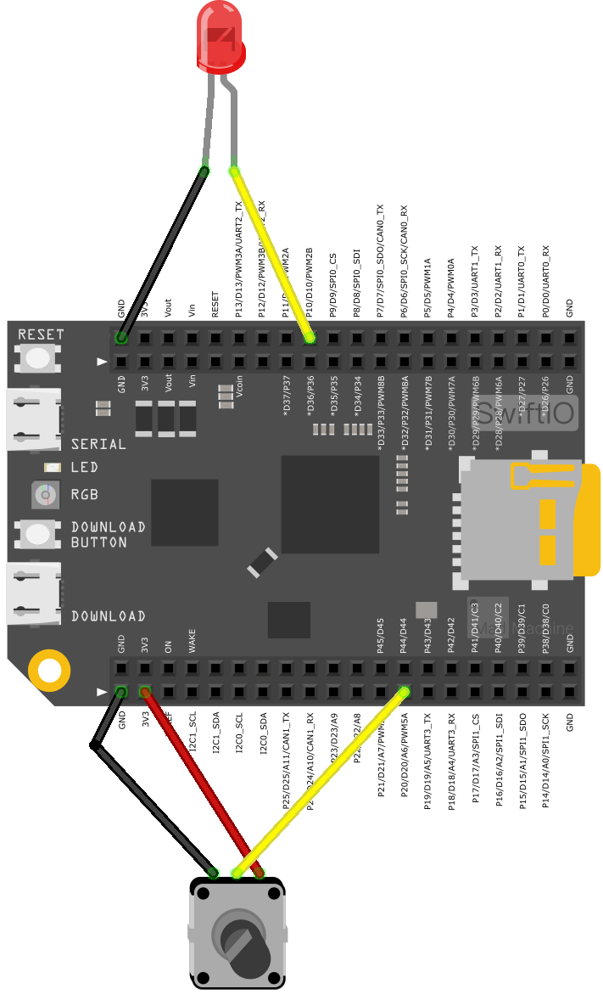

# This is a ToDo List

## Overall

1.  Make the sentence in all documents agree in each other. i.e. use "we will..." instead of "you will..."

## BrightnessAnalogIn.md

1. in this file, the circuit graphic should be change. The led Light lacks a resistor.

2. there's no red line in the graphics showing the duty cycle in Instruction

3. Not understanding what it means in Instruction

> Correspondingly, analogIn's `readRawValue()` is not called this time, but the corresponding return value range of readPercent() is 0 to 1.

> In our opinion, motion blurs each LED flashing into a line. As the LED fades in and out, the length of these thin lines will increase and decrease. Now you will see the pulse width.

## LEDsBrightnessControl.md

1. Not understandable. You cannot just say there's three and mention only one of them. In the instructions part

>`let leds = [red, green, blue]`Swift provides three primary collection types, known as arrays, arrays are ordered collections of values. You access and modify an array through its methods and properties, or by using subscript syntax. such as leds.red, leds.green, leds.blue.

2. Also mention how to passively declare the type of the variable?

## PWMMelody.md

1. cannot understand what's going on here

> The code above uses a Frequency as musical pitches. For example, NOTE_C4 is middle C, whose frequency is 262 Hz. Latter example MidiPlayer we will markdown all this musical note in a file. This file contains all the pitch values for typical notes. You may find it useful whenever you want to make musical notes.
>
> Quote from Instructions

## PWMSoundOutput.md

1. cannot understand what's going on here

> The code above uses a Frequency as musical pitches. For example, NOTE_C4 is middle C, whose frequency is 262 Hz. Latter example MidiPlayer we will markdown all this muscial note in a file. This file contains all the pitch values for typical notes. You may find it useful whenever you want to make musical notes.
>
> Quote from Instructions