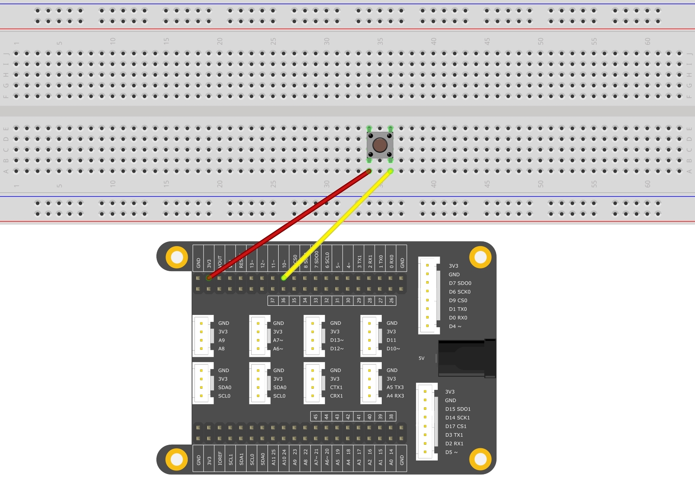

# ButtoncontrolLED


In this example, you will use a pushbutton to control the LED.

The input signal will change as you press the button. Thus, you can set LED states according to different input states.

## What you need

* SwiftIO board
* Button
* Jumper wires

### Kits that meet the experimental conditions: <a id="kits-that-meet-the-experimental-conditions"></a>

* ​[Maker Kit for SwiftIO](https://www.madmachine.io/product-page/maker-kit-for-swiftio)​

## Circuit



There is an onboard RGB LED. Please apply a **low** voltage to light it.

The button has four legs. The two legs on the same side are interconnected.

* Connect the leg on the left side to the 3.3V pin. 
* Connect the leg on the right side to digital pin D10.

In default mode, the digital pin reads `false`. When you press the button, the two points on the button will be connected. And the value of the pin will be `true`.

So please be sure you connected the button the right way.

## Code

Here comes the code. You can find the example code at the bottom left corner of IDE:  &gt; SimpleIO &gt; ButtoncontrolLED.

```swift
// Read the input signal controlled by a button to turn on and off the LED.
// Import the library to enable the relevant classes and functions.
import SwiftIO

// Import the board library to use the Id of the specific board.
import SwiftIOBoard

// Initialize the red onboard LED.
let red = DigitalOut(Id.RED)

// Initialize a digital input pin D0 the button is connected to.
let button = DigitalIn(Id.D0)

// Allow the button to control the LED all the time.
while true {
    // Check the state of button. If it is pressed, the value will be true and then turn off the LED.
    // Modify the code according to your button if necessary.
    if button.read() {
        red.write(false)
    } else {
        red.write(true)
    }

}
```

## Instruction

First, you'll need to check the button state. `.read()` method reads the value from the digital input pin. The return value is a boolean value, either `true`\(1\) or `false`\(0\). Then use if-statement to decide the LED state according to the value. If the value is true, that means the button is pressed, light the LED, otherwise, turn off the LED.

If you have experience with Arduino, you may notice there's no pull-down resistor on the button. That's because the SwiftIO Board already has built-in pull resistors. Reference the [Mode](https://swiftioapi.madmachine.io/Classes/DigitalIn/Mode.html) in `DigitalIn` class for more information.

## See Also

* [Id](https://swiftioapi.madmachine.io/Enums/Id.html) - Enumerations of all the pins on the board.
* [DigitalIn](https://swiftioapi.madmachine.io/Classes/DigitalIn.html) - Detect the state of a digital input pin. The input value is either true \(1\) or false \(0\).

