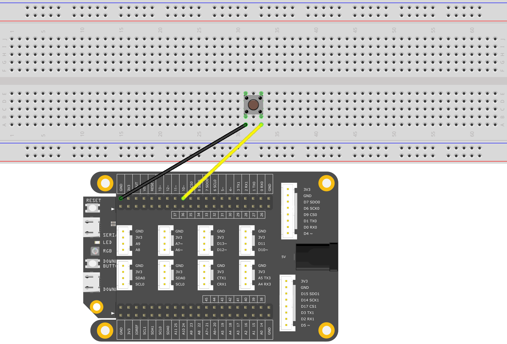

# ButtoncontrolLED


In this example, we will use a push-button to control the LED.

The input signal will change as you press the button. Thus, you can set LED status according to different input states.

## What you need

* SwiftIO board
* Button
* Jumper wires

### Kits that meet the experimental conditions: <a id="kits-that-meet-the-experimental-conditions"></a>

* ​[Maker Kit for SwiftIO](https://www.madmachine.io/product-page/maker-kit-for-swiftio)​

## Circuit



There is an onboard RGB LED. Please apply **low** voltage to light it.

The button has four legs. The two legs on same side are interconnected.

* Connect the leg on left side to 3.3V pin. 
* Connect the leg on right side to digital pin D10.

In default mode, the digital pin reads `false`. When you press the button, the two points on the button will be connected. And the value of pin will be `true`.

So please be sure you connected the button in a right way.

## Code

Here comes the code. You can find the example code at the bottom left corner of IDE:  &gt; SimpleIO &gt; ButtoncontrolLED.

```swift
// Read the input signal controlled by a button to turn on and off the LED.

// Import the library to enable everything in it, like relevant classes and methods. 
// This is first step for your coding process.
import SwiftIO

// Declare a constant. You may choose any descriptive name you like. 
// Initialize the onboard red LED. 
// The Id of onboard LED should be capitalized.
let red = DigitalOut(Id.RED)

// Initialize a digital input pin D10 the button is connected to.
let button = DigitalIn(Id.D10)

// Allow the button to control the LED all the time.
while true {
    // Check the state of button. 
    // If it is pressed, the value will be true and then turn off the LED.
    // Modify the code according to your button if necessary.
    if button.read() {
        red.write(false)
    } else {
        red.write(true)
    }
}
```

## Instruction

`DigitalIn` class is intended to detect the state of a digital input pin. The input value is either `true`\(1\) or `false`\(0\). The `.read()` function reads the value from a digital input pin.

If you have the experience with Arduino, you may notice there's no pull-down resistor on the button. That's because the SwiftIO Board already provides a pull-down function. Reference the `DigitalIn` class for more information.

## See Also

* [Id](https://swiftioapi.madmachine.io/Enums/Id.html) - Enumerations of all the pins on the board.
* [DigitalIn](https://swiftioapi.madmachine.io/Classes/DigitalIn.html) - Detect the state of a digital input pin. The input value is either true \(1\) or false \(0\).

