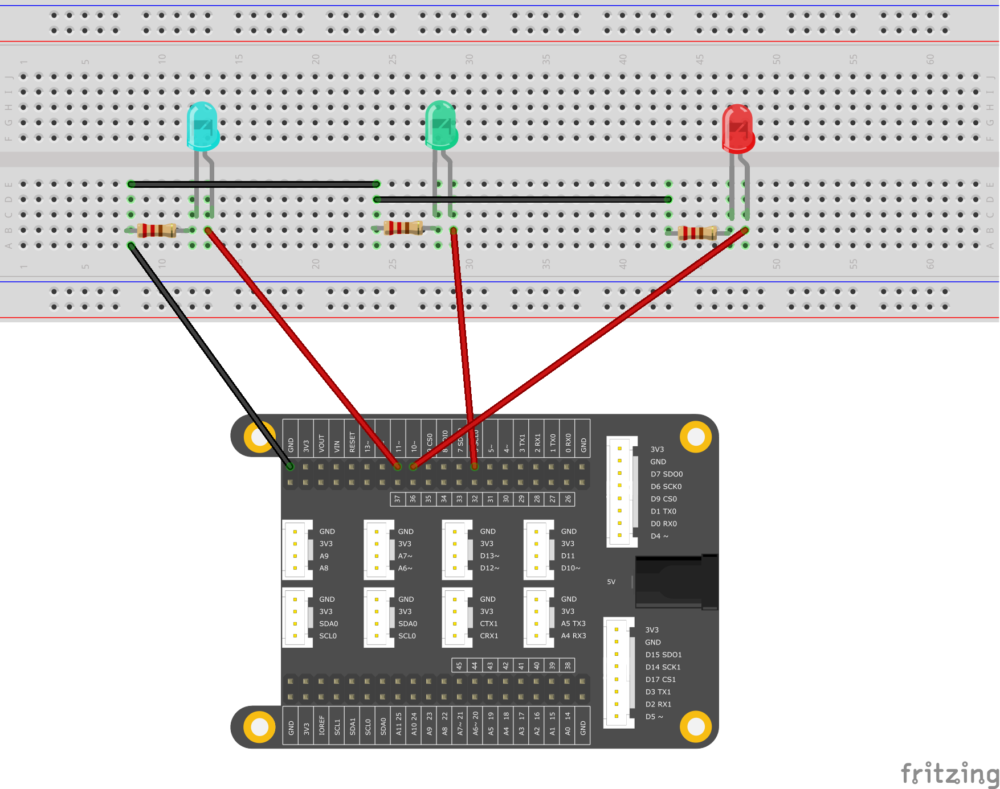

# <span style="color:#EA5823;font-weight:800">LEDsBrightnessControl</span>


This example demonstrates the usage of analog output (Pulse Width Modulation, PWM) to fade three LEDs. PWM is a technique to obtain an analog-like behavior from a digital output by switching it off and on very fast, and with different ratio between on and off time.

## <span style="color:#EA5823;font-weight:700">What you need</span>

- SwiftIO board
- Jumper wires
- 3x330ohm resistor
- 3 color LED Modules (3x color LEDs and 3x 10k ohm resistors)
- SwiftIO shield (optional)

## <span style="color:#EA5823;font-weight:700">Circuit</span>




## <span style="color:#EA5823;font-weight:700">Code</span>

```swift
// Change the LED state every second by setting the interrupt.

// Import the library to enable the relevant classes and functions.
import SwiftIO

// Initialize the pins the LEDs are connected to and put them in a array.
let red = PWMOut(Id.PWM2B)      //P10 D10
let green = PWMOut(Id.PWM3B)    //P12 D12
let blue = PWMOut(Id.PWM4A)     //P20 D20 A6
let leds = [red, green, blue]   //Arrays, one of Collection Types

// Declare a variable to store the value of duty cycle.
var value: Float = 0.0

// Change the brightness of each LED over and over again.
while true {
    for led in leds {
        // Brighten the LED in two seconds.
        while value <= 1.0 {
            led.setDutycycle(value)
            sleep(ms: 20)
            value += 0.01
        }
        // Keep the value of duty cycle between 0.0 and 1.0.
        value = 1.0
        // Dimming the LED in two seconds.
        while value >= 0 {
            print(value)
            led.setDutycycle(value)
            sleep(ms: 20)
            value -= 0.01
        }
        // Keep the value of duty cycle between 0.0 and 1.0.
        value = 0.0
    }
}

```

## <span style="color:#EA5823;font-weight:700">Instruction</span>

`let leds = [red, green, blue]`

Swift provides three primary collection types, known as arrays, arrays are ordered collections of values. You access and modify an array through its methods and properties, or by using subscript syntax. such as `leds.red`, `leds.green`, `leds.blue`.

`var value: Float = 0.0` explicitly declares that the type of value is a floating-point number type, not an integer type. Explicitly declaring the type is very important for scenarios where the type is easy to be confused. The subsequent use shows that the variable must be a floating-point real number.

You can iterate over the entire set of values in an array with the for-in loop: `for led in leds` This is the reason why we want to create the array `leds`. With the for-in loop syntax structure, the elements are It becomes very convenient and concise when traversing and iterating.

<!--
`let leds = [red, green, blue]`Swift provides three primary collection types, known as arrays, arrays are ordered collections of values. You access and modify an array through its methods and properties, or by using subscript syntax. such as leds.red, leds.green, leds.blue.
`var value: Float = 0.0`显式声明了value的类型是浮点数类型，而不是整数类型，显式声明类型对于容易混淆类型的场景非常重要，后续使用说明了这个变量必须是浮点型实数。
You can iterate over the entire set of values in an array with the for-in loop: `for led in leds` 这就是我们要创建数组`leds`的原因，配合for-in loop语法结构，在对其元素进行遍历和迭代时会变得非常方便和简洁。
-->

## <span style="color:#EA5823;font-weight:700">See Also</span>

- [Numeric Type Conversion]() - An integer type can be initialized with a Double or Float value.
- [for-in loops](https://docs.swift.org/swift-book/LanguageGuide/ControlFlow.html) - You use the for-in loop to iterate over a sequence, such as items in an array, ranges of numbers, or characters in a string.

## <span style="color:#EA5823;font-weight:700">References</span>

- [swift: Collection Types](https://docs.swift.org/swift-book/LanguageGuide/CollectionTypes.html)
- [wiki: Pulse-width modulation](https://en.wikipedia.org/wiki/Pulse-width_modulation)
- [wiki: Duty cycle](https://en.wikipedia.org/wiki/Duty_cycle)

---
Last Edit 2020/09/14 by Martin

> Grammar fixes, translation fixes

Last revision 2020/09/10 by Johnson