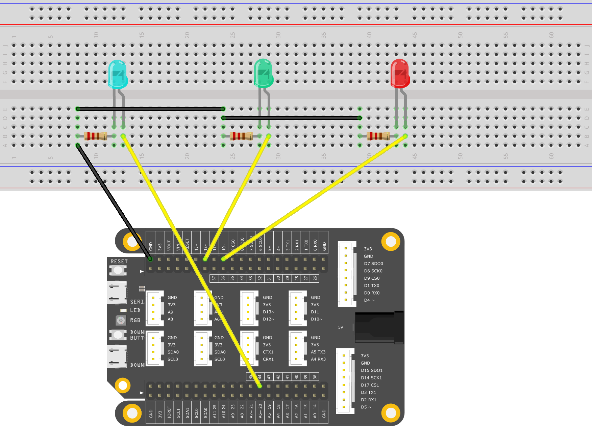

# LEDsBrightnessControl


In this example, you're going to change the brightness of three LEDs one by one. This is similar to the previous PWM brightness control. 

## What you need

* SwiftIO board
* Jumper wires
* 3x color LEDs and 3x 330-ohm resistors \(or 3-color LED Modules\)
* SwiftIO shield \(optional\)

## Circuit



## Code

```swift
// Change the LED state every second by setting the interrupt.
// Import the library to enable the relevant classes and functions.
import SwiftIO

// Import the board library to use the Id of the specific board.
import SwiftIOBoard

// Initialize the pins the LEDs are connected to and put them in a array.
let red = PWMOut(Id.PWM0A)
let green = PWMOut(Id.PWM1A)
let blue = PWMOut(Id.PWM2B)
let leds = [red, green, blue]

// Declare a variable to store the value of duty cycle.
var value: Float = 0.0

// Change the brightness of each LED over and over again.
while true {
    // Iterate each LED in the array. 
    // This allows the LED to go through the following process one by one.
    for led in leds {
        // Brighten the LED in two seconds.
        while value <= 1.0 {
            led.setDutycycle(value)
            sleep(ms: 20)
            value += 0.01
        }
        // Keep the value of duty cycle between 0.0 and 1.0.
        value = 1.0
        // Dimming the LED in two seconds.
        while value >= 0 {
            print(value)
            led.setDutycycle(value)
            sleep(ms: 20)
            value -= 0.01
        }
        // Keep the value of duty cycle between 0.0 and 1.0.
        value = 0.0
    }
}
```

## Instruction

`let leds = [red, green, blue]` This is one of the Swift collection types, known as an array. The array is an ordered collection of values. You could access and modify an array through its methods and properties, or by using subscript syntax, such as `leds.red`, `leds.green`, `leds.blue`.

You can iterate over the entire set of values in an array with the for-in loop: `for led in leds`. This is the reason why we want to create the array `leds`. With the for-in loop syntax structure, it's very convenient and concise to iterate each one in it. Or, you might need to write the same block of code many times.

## See Also

* [for-in loops](https://docs.swift.org/swift-book/LanguageGuide/ControlFlow.html) - You use the for-in loop to iterate over a sequence, such as items in an array, ranges of numbers, or characters in a string.

## References

* [swift: Collection Types](https://docs.swift.org/swift-book/LanguageGuide/CollectionTypes.html)
* [wiki: Pulse-width modulation](https://en.wikipedia.org/wiki/Pulse-width_modulation)
* [wiki: Duty cycle](https://en.wikipedia.org/wiki/Duty_cycle)

