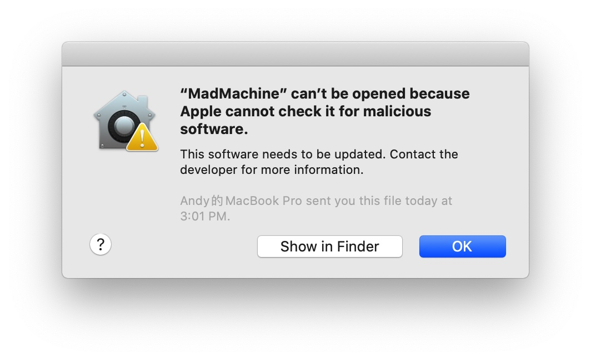
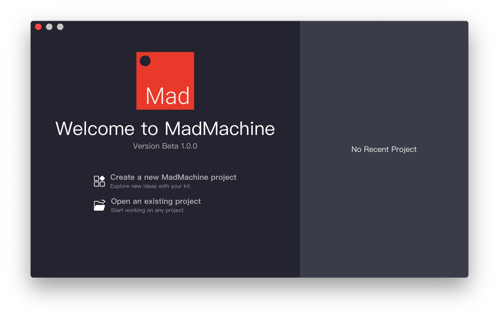
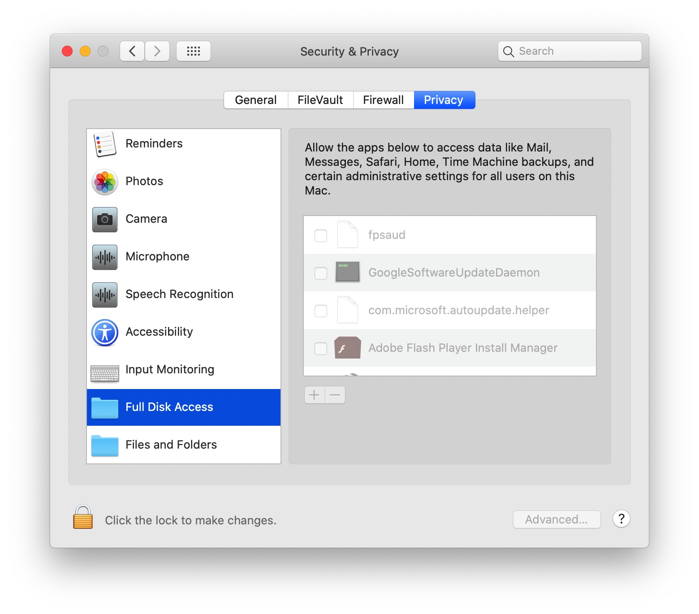
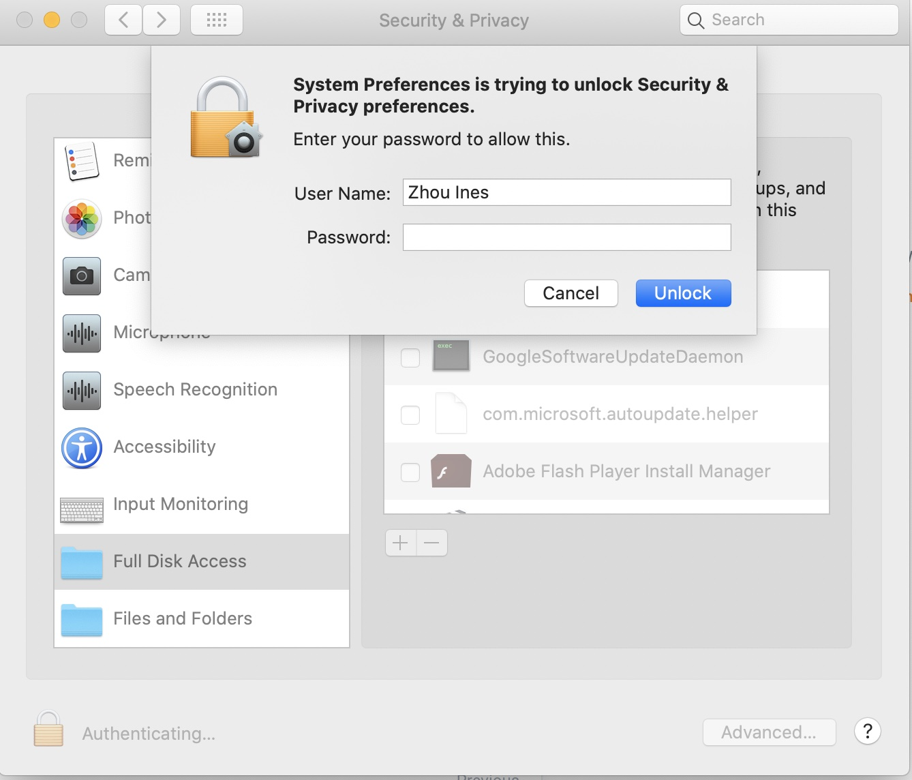
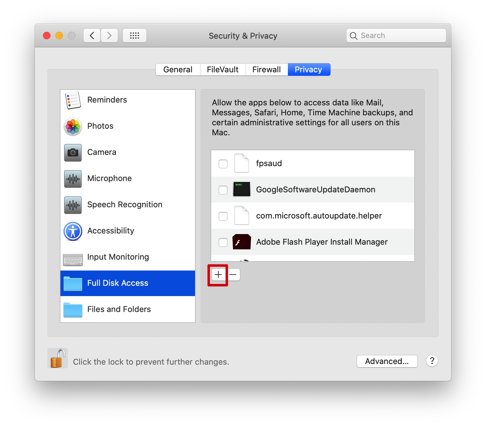
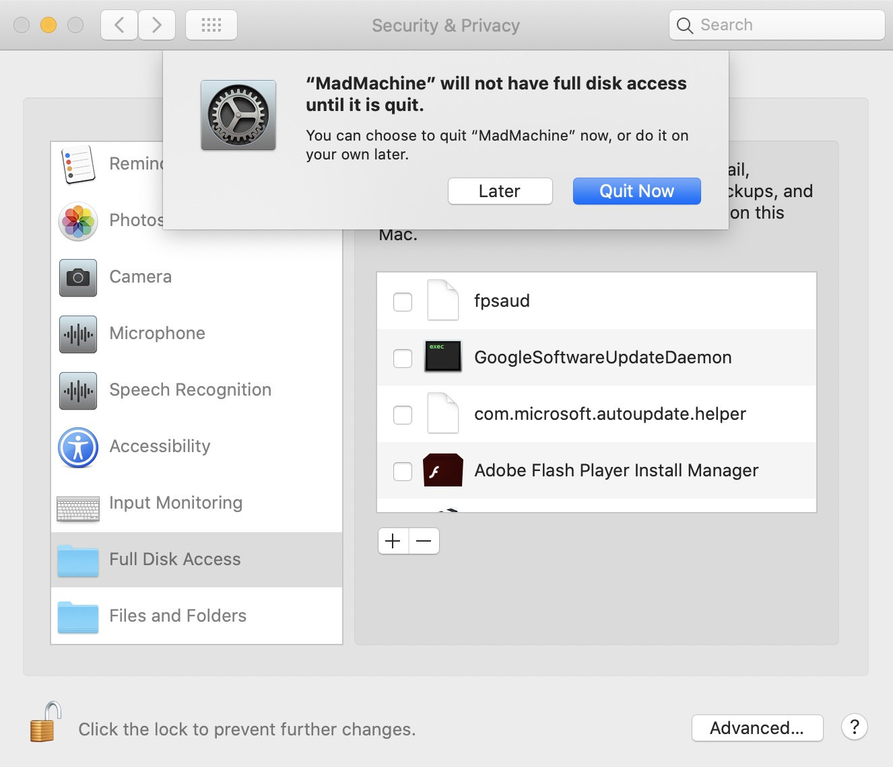

# FAQ

## Can't install the IDE on Win10

Windows may not recognize the IDE and there might be some problems when you install it. Windows Defender will pop up with a warning message.

First, click on the "**More info"**.

Then more info will appear. Click "**Run anyway**".

## Can't open IDE on Mac

When you want to open the IDE, a new window appears:

👇 Here comes the solution:

* click **OK**.
* select  &gt; **System Preferences**
* open the **Security & Privacy** Preferences pane
* select the **General** tab

* click the 🔒 icon
* enter your **Password**
* click **Unlock**

* click **Open Anyway**

* click **Open**

Now the IDE can run normally.

## Can't create new project on Windows

**Reason:** The IDE need to copy `MadMachine\Examples` and `MadMachine\Library` to your `Documents` directory when running for the first time.

**Solve:** Please make sure run the IDE as **Administrator** for the first time!

## IDE can't find the USB drive

This is due to the security feature of macOS.

The latest versions of macOS introduce new security control. There are more requirements for application security.

While our board needs to manage the files on the USB driver. So you need to enable **Full Disk Access** for IDE.

* select **System Preferences** in Apple menu
* open the **Security & Privacy** Preferences pane
* select the **Privacy** tab
* click **Full Disk Access** in the left column

* click the 🔒 icon
* enter your **Password**
* click **Unlock**

* click the icon **+**

* click **Application**
* find the **MadMachine**
* click **Open**

* click **Quit Now**

Now you can try to download your project again.

## **SwiftIO board reset repeatedly**

There is a maximum current limit for the USB port of your devices.

While some modules which is connected to the board may require a larger one.

Thus the board reset over and over again.

You can try these ways:

1 _\*\*_connect the board to USB port that can output larger power.‌

2 connect both download port and serial port on the board to USB ports

3 use a power bank to supply the board

## **USB driver can't be mounted**

This problem may be caused by these reasons

1. Bad quality USB cable, there are so many bad quality USB cables in the market. Some of them can only charge your device without communication feature : \(
2. Incompatible microSD card
3. Incompatible USB hub or incompatible USB-C to USB-A adapter
4. There is a known issue about USB compatibility on Mac. There are already a lot of discussion about it on [reddit](https://www.reddit.com/r/mac/comments/gp5b1z/usb_20_issues_on_new_macbook_pro_13_2020/), [apple](https://discussions.apple.com/thread/251356598).

To solve problem 1 and 2, we offer a high quality USB cable and a Kingston microSD card along with our board. But we still got feedback that the USB drive did not appear. In this situation, there is a temporary solution: use a microUSB card reader to copy the `swiftio.bin`. At the same time, we’ll continue to improve the compatibility of the firmware.

