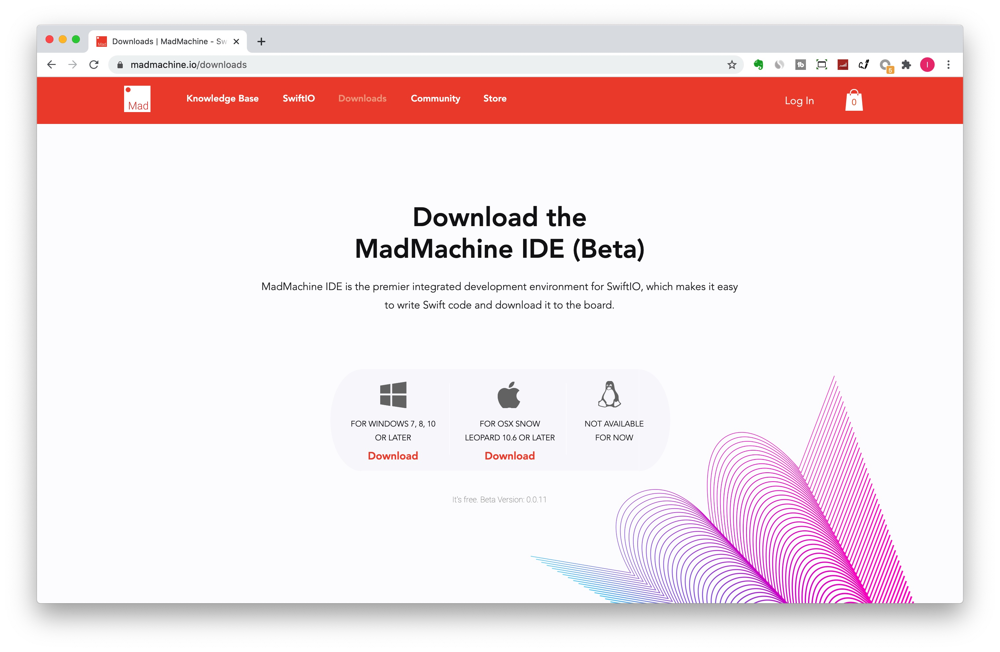

# Getting Started

Get your SwiftIO board? Follow us step by step to realize your first project.

### **Step 1: Download and install the MadMachine IDE**

The MadMachine IDE provides you with an easy way to code. It is available on Windows and Mac. 

So first of all, you need to download and install the MadMachine Software \(IDE\) to program your SwiftIO board. You'll find it from the project [website](https://www.madmachine.io/downloads). Select the appropriate version according to your operating system. 

