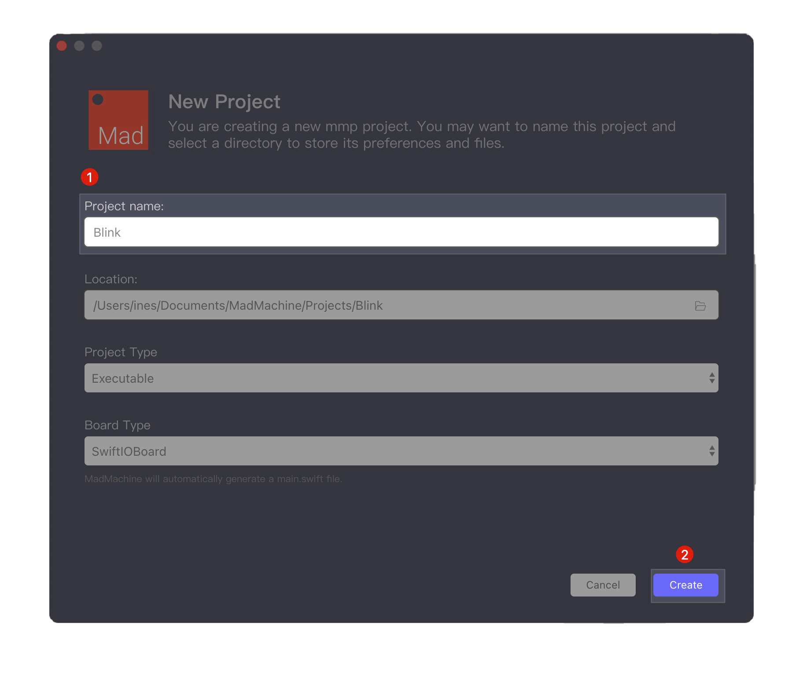

# Getting Started

So, you‘ve got your SwiftIO board. Let's start with a hello world project - LED blink. Follow us step-by-step to run your first project on the SwiftIO board.

## **Step 1: Download and install the MadMachine IDE**

At first, you need to download the MadMachine IDE. It is a simple tool to allow you to write the code and download it to your board.  

The IDE is available on **Windows** and **Mac**. You could find the software package [here](https://github.com/madmachineio/MadMachineIDE/releases/tag/v0.1.1). Select the appropriate version according to your operating system. 

_Note: if you're an experienced programmer, you may edit your code wherever you like and use the_ [_mm-sdk_](tutorial/how-to-use-mm-sdk.md) _to compile your code._

Double click the downloaded file and follow the installation instructions. If you meet with any problem, you could refer to [FAQ](faq.md). 

## **Step 2: Code in the IDE**

OK, you're ready to code. 

* **Open** the MadMachine IDE. Now it's empty on the right side, as you create and try more projects, it will be filled with all your projects.
* Click **Create a new MadMachine project**.


* **Name** the project. We call it "Blink". You could choose any descriptive name you like for the project. Leave the rest as they are. 
* Then click **Create**.



Now it's time to write the code. 

* Click `Sources` &gt; `Blink` &gt; `main.swift`. You always edit the code in the file `main.swift`. Copy and paste the following code into the file.

```swift
import SwiftIO
import SwiftIOBoard

let green = DigitalOut(Id.GREEN)
​
while true {
    green.write(true)
    sleep(ms: 1000)
    green.write(false)
    sleep(ms: 1000)
}
```

_Note: there are built-in example codes in the IDE. You could click the button_  _on the bottom left corner._


_Choose **GettingStarted** &gt; **Blink**. The code will show up in a new window._


## **Step 3: Prepare SD card and confirm USB connection**

You could notice the message on the status bar. The board is connected yet. So you will need to connect it to your computer.

* **Make sure** that you have inserted an SD card into the slot.
* Connect the SwiftIO board to your computer through the **Download port** using a Micro-USB cable.
* Press the **DOWNLOAD button** beside the port. SwiftIO board will be mounted as a USB Drive on your computer. 

Here is an illustrational instruction.


_**Note:** Bad quality USB cable or some third-party USB hub may cause connection failure._

The onboard RGB LED will show the current status of the USB connection. Wait until it turns to steady green.

| LED State | RED | GREEN | BLUE |
| :--- | :--- | :--- | :--- |
| On | USB communication failed | USB connection established | - |
| Slow flashing | Fail to verify file `swiftio.bin` | - | - |
| Fast flashing | Fail to open file `swiftio.bin` | Detecting USB connection | Detecting SD card |

## **Step 4: Build your code and download it to the board**

* Once the SD card is mounted successfully, the message on the status bar will change to "**SwiftIOBoard ready**".
* Click the **Download**  button.


The IDE begins to build your project, and then download it to your board if there is no error.

After the code is downloaded, the USB drive will be removed automatically.


Well, the onboard LED starts to blink✨.

Btw, you can also watch this tutorial [video](https://www.youtube.com/watch?v=frVKQXU12LQ) to get more info.

