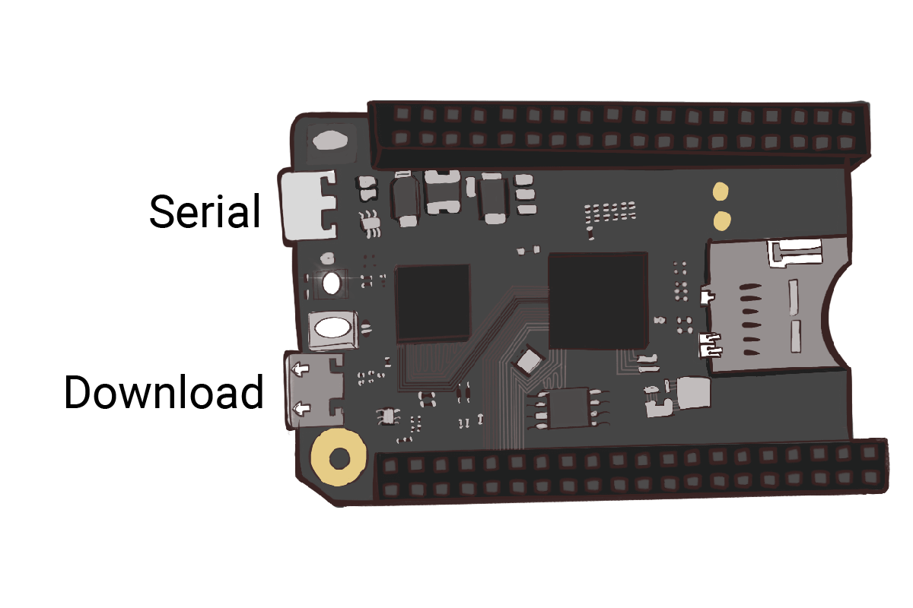
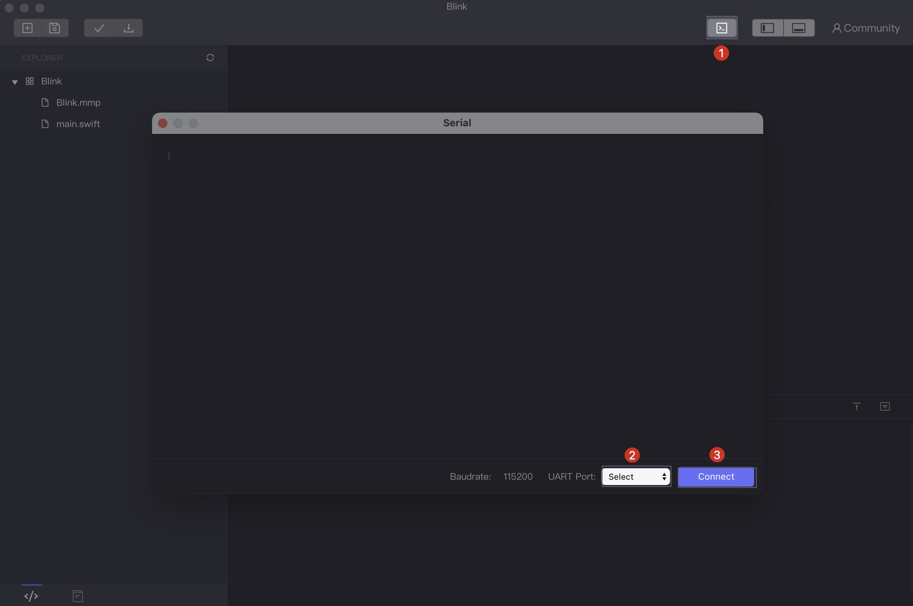

# How to debug

You must have met similar situations: your code is downloaded to the board, but doesn’t work out as you have predicted. How to deal with it... At that time, you’ll need to debug you code.

There are two common ways. One is to step through it, which is not supported. So the best way by now is to print the information out. Then you could judge which step goes wrong according to the info.

Let’s see how it works.

### 1. Add `print()` phrase in your code

After each line of code that is related a value, you could add `print()` function to view it, in case of any unexpected mistakes. Then download the code to your board.

### 2. Connect the board to computer through serial port

Now you will need to change the USB connection from download port to serial port. 

SwiftIO board has two ports: download port and serial port. They might be quite confusing at the beginning.

* **Download** port allows you to download code to your board. 
* **Serial** port is for serial communication between your board and computer. The serial communication is commonly used on microcontrollers, however the computer hardly use it, so a serial to USB converter is added to the board to allow the data transmission between them. It is an independent part specially for this use.

### 3. Open serial monitor on the IDE

1. Click on the serial monitor button on the upper right corner. 
2. Select the matched **UART Port** as the second image. If you can't find it, don't worry. Close the Serial monitor, wait a while, then open it again.
3. Click **Connect**.

### 4. Find the problem

After successfully connected, the values will be printed out. 

If there is something wrong when executing the code, you would notice the code is blocked at a certain step, and the following value will not be printed. Then you could infer if the board crashed or some steps go wrong.

If the code works normally, you could pay attention to the values, if they are out of range, if the calculation formula is wrong by accident, and so on.

