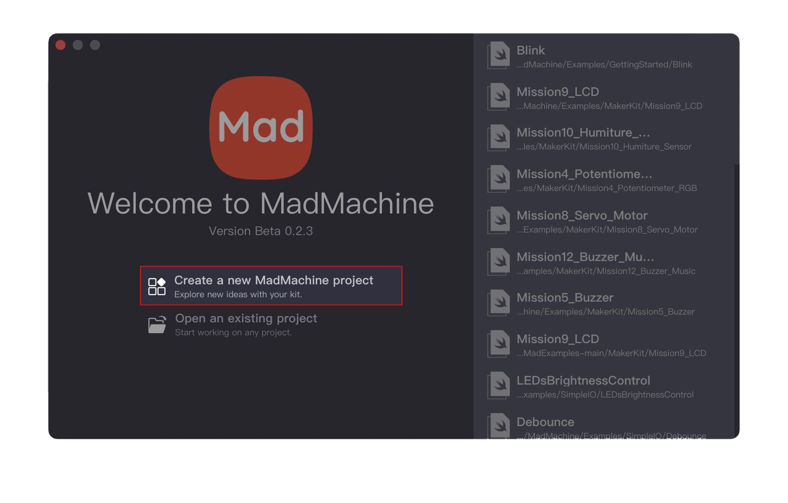

# How to select board in IDE

## Select when creating a new project

When you create a new project, you could choose the board you would like to deal with.

Open the MadMachine IDE, click **Create a new MadMachine project**.

Name the project. Select the **Board Type**. In the dropdown menu, you could find two boards, and choose the one you are using. 

After creating a project, you could notice the message on the status bar that indicates the board.

## Change the board when editing the code

You want to change the board in some existing projects? OK, no problem.

In the file `Package.swift`, change the **board** type and click the **save** button.

After the file is saved, the message in the status bar would change accordingly.

