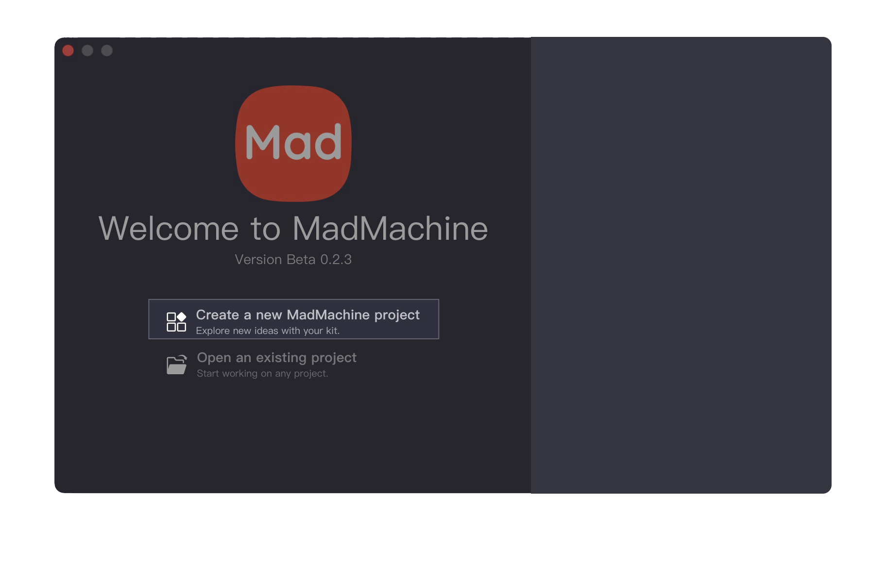
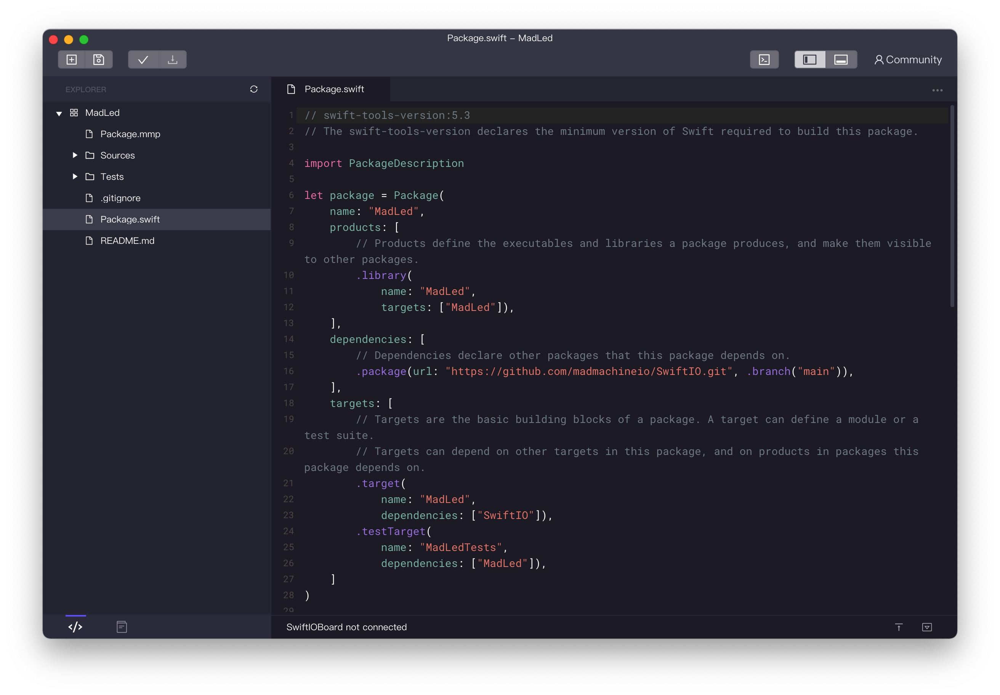
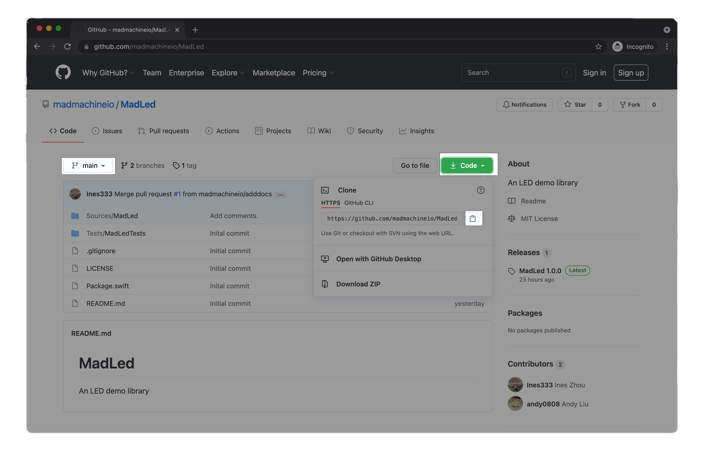
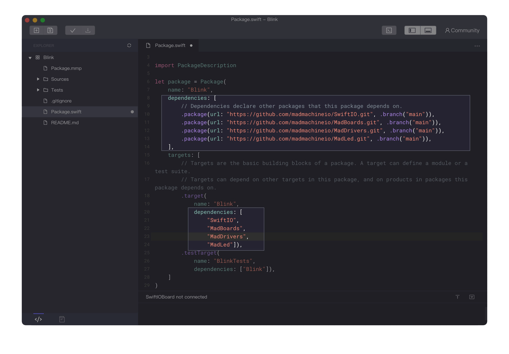

# About library

The library usually contains a block of codes that provides specific functionalities. Then you could use it in any of your projects to realize those functionalities. Let's take a deeper look at it.

_Note: Only the Mac version of MadMachine IDE supports the Swift Package Manager now. So the tutorial below is based on the Mac version. We will find ways to support the Windows version later. For the moment, you could try our CLI tool_ [_MM SDK_](how-to-use-mm-sdk.md)_._

## How to write a library

When you deal with the LEDs, sometimes you need to set a high voltage to turn on it, sometimes it's low voltage. It's quite confusing. Why not write a library to make it easier?

### Before start

First, let's figure out what this library is used to do. 

When you light a LED, you need to identify if it will be **on** with high voltage or low voltage. Then you need to set the corresponding voltage. So you are going to take them apart, and solve them one by one in the library.

Then you will find out why there are different situations to light the LED. 

It depends on how the LED is connected to your circuit. There are two ways to connect the LED: 

* In the first circuit, the LED is connected to the power and a digital pin. Since the current always flows from high to low voltage, if the pin outputs a high voltage, there is no voltage difference between the two ends of the LED, so the LED is off. Only when the pin outputs a **low** voltage, the current could flow from the power to the pin and the LED will be on. This is how the onboard LED works.

* In the second circuit, the LED is connected to the digital pin and ground. If the pin outputs a high voltage, the current flows from the pin to the ground, the LED will be on. If it outputs a low voltage, the LED is off.

### Create a new project

Now that you make it clear how to turn on the LED, you could start your library. 

Open the MadMachine IDE. **Create** a new project. 

**Name** the project. In the **Project Type** drop-down menu, choose **Library**. 

_Note: you could notice there are two options: an **executable** is a program that could run on your board; a **library** provides some functionalities and could be imported to other projects._ 

Click **Create**.

Well, the project is created. Let's look at the file `Package.swift`. This file defines your project name and the dependencies. It is created automaticlly once you create your project. Usually, you'll not do any changes to this file. Here are some quick overviews of this file:

* One project is a **package**. You could see its name is `MadLed` in line7. 
* The package has **products** that could be either executables or libraries. This is a library as shown in line8. It shares the same name `MadLed`.
* The library could have one or more **targets**. What you import in other projects is the target. Here it has only one target with the same name `MadLed`.
* Then you will indicate the location of the dependencies. The SwiftIO source code is stored [here](https://github.com/madmachineio/SwiftIO). 

### Write code

Let's come to the code. Open the file `MadLed.swift` in folder `Sources/MadLed`.

* The first step is certainly to **import** the dependencies. You'll need to import the `SwiftIO`.
* All your libraries related to the hardware need to use **class**. Since struct instances are always passed by value, and class instances are always passed by reference. While the corresponding hardware is unique, when you change any of the instances, the hardware will change accordingly. If the struct is used, one instance is changed, others remain unchanged, this will cause confusion. So the class is used here.
* This class is declared to be **final**, so it cannot be inherited by others.
* You could notice the keyword **`public`** and **`private`** in the code. They decide the access control of your class. `public` means any other parts could use it. In this code, like the class, the initializer, and the methods, they will be used to create code, so they are public. `private` means it could only be used inside the class. The properties `pin` and `ledOnValue` are used only in this class, so they are private.
* To light a LED, you must initialize a digital pin. So you declare a **property** `pin` to be `DigitalOut`. Then to make it more clear, you create a property `ledOnValue` to store the value to turn on the LED, `true` or `false`. For example, if you use the onboard LED, this value will be `false`.
* The two properties above don't have a default value, since they will change according to your circuit. Thus you will need an **initializer**. It takes two parameters, which correspond respectively to the properties. Since they share the same name, `self` is added to identify them. `self.pin` refers to the property `pin` above. When you pass values to the parameters, the values will be assigned to the two properties. 
* After the initializer, you need to create some **methods** to control the LED. Let's have a look at the method to turn on a LED. Since the `ledOnValue` defines the value to turn on a LED, you don't need to care about its value now and directly pass the value to the method `write()`. 

Well, that's a brief intro about how to created a basic library to control the LED. You could find its code [here](https://github.com/madmachineio/MadLed). Then you could start to use it in your project.

## How to use a library

Let's see how you could use the libraries. We will use the library `MadLed` created above.

### Add dependencies

After you create a project, you will need to add the dependencies to it. 

All our libraries are stored on Github. You could find it [here](https://github.com/madmachineio/MadLed). Click **Code** and you will get a drop-down menu. Click the button to **copy** the URL.

In the file `package.swift`, you indicate the **location** of the library and its **name** in `dependencies` as the two highlight parts below. Paste the URL of the package. And this package is in the main branch.

_Note: if the library is on your computer, you could indicate its path._

### Import the targets

In the file `main.swift`, import the targets that are needed for your project. You could notice in the line2 that you import the `SwiftIOBoard` . It is one of the targets of `MadBoards`. The other two are the unique target in their library that shares the same name with the library.

Then you could start to code.

With Swift Package Manager, you don't need to install the libraries manually. It's really convenient.

As you build your project, the file `Package.swift` will be built first, then the IDE will automatically get the libraries from Github. So it will cost a while the first time you build it. 

