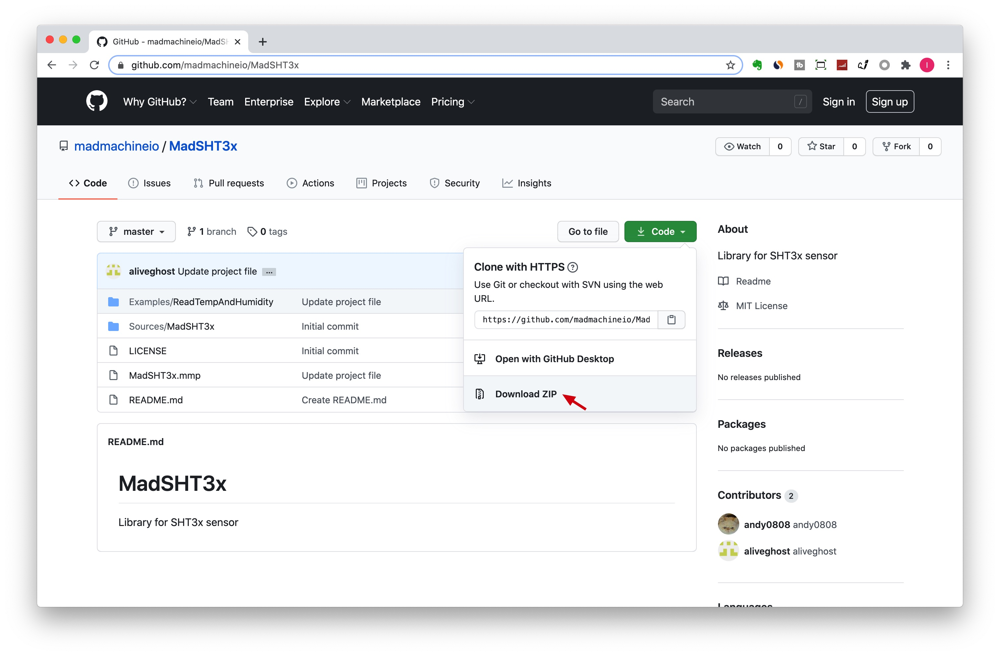
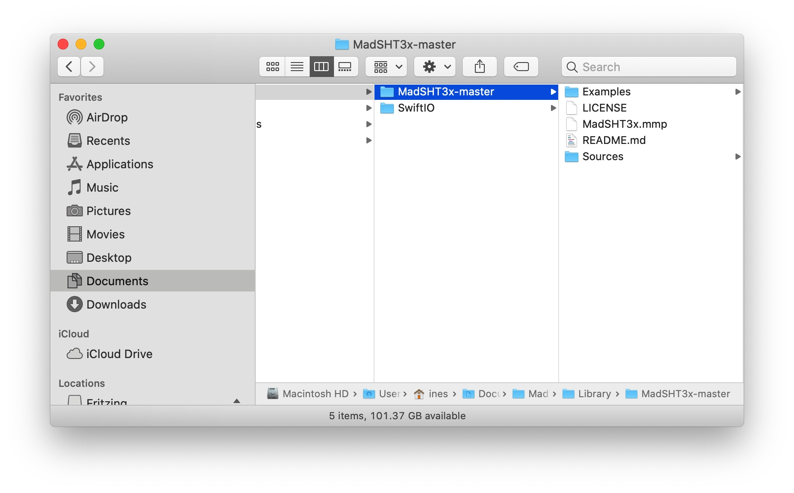
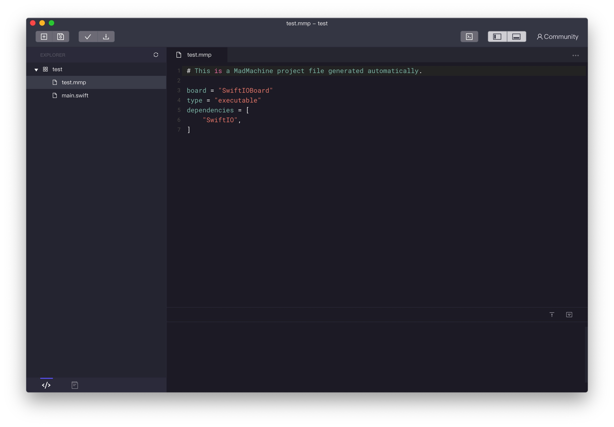
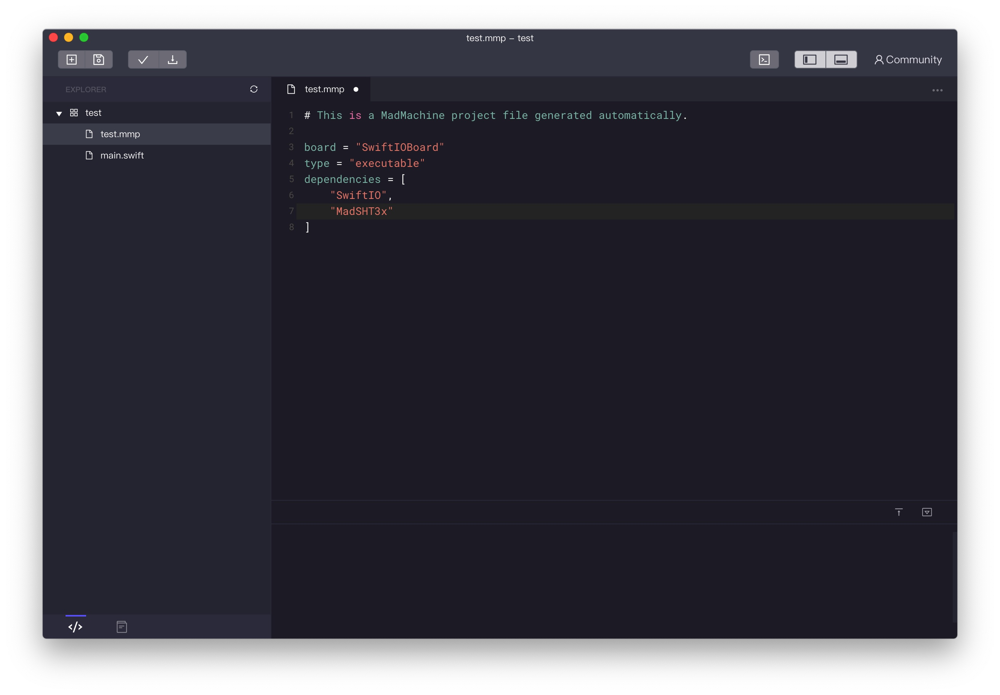

# Libraries

## Install a library

Libraries make your coding process more easily. With different libraries, you can control many modules using some simple methods. ‌ ‌

Now let's learn how to install a library.

1.First, download the library from Github. ‌ I'll take the library MadSHT3x for example.

2.Enter the MadSHT3x. Select **Code** &gt; **Download ZIP**.

3.Unzip the package and move the folder to **Documents** &gt; **MadMachine** &gt; **Library**.

4.Open the IDE. Create a new project.

5.In the file **xxx.mmp**, add the library MadSHT3x in dependencies. ‌

6.Import the two libraries in your project.

‌ Now you can use everything in the library to create your project.

